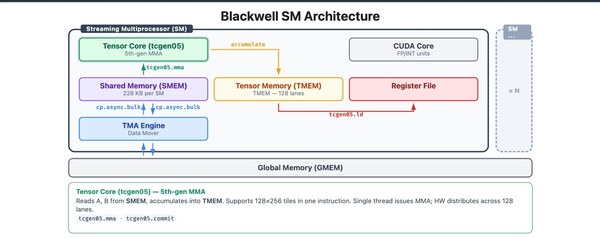
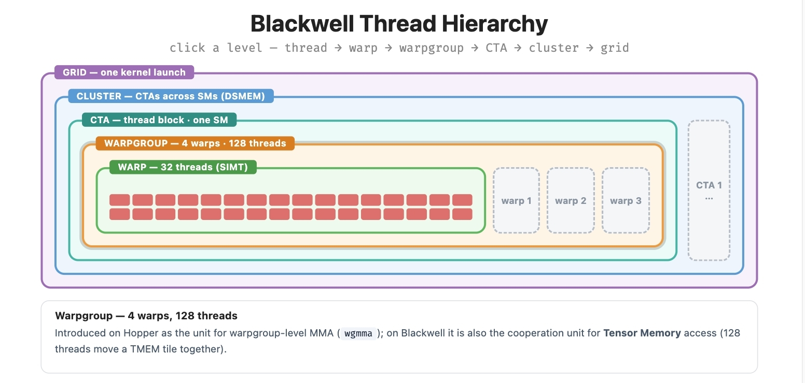

# GPU 编程模型

## GPU执行模型

- thread：最小标量计算单元，有自己的寄存器，PC等。
- warp：32个thread组成一个warp，一个warp是一个SIMD(single instruction multiple data)执行单元，因为每个lane(thread)独立pc、寄存器，实际warp中的不同thread 可能执行不同的代码分支。
- warp group：4个warp构成一组，是wgMMA的执行单元。
- CTA (thread block): 最小的硬件调度单元，一个 block 一起被分配到一个 SM 中执行，一个SM中可能被分配多个CTA。CTA会拥有独立的shared_memory，执行完成后才会释放占用的shared_memory，一个SM上的多个CTA的shared_memeory共享SM的物理存储。
- cluster：多个相关的thread，可以分布到不同的 SM 中，同一个cluster中的CTA可以相互直接访问对方的shared memory, 从而组成distributed shared memory。
- grid：kernel lunch的调度所有计算资源集合

## GPU 内存模型

| 内存类型 | 所有者 | 作用 | 其他 |
|-|-|-|-|
| GMEM (global memory) | GPU 整个设备 | 持久化存储 | 容量大，所有sm共享 |
| SMEM （shared memory） | Per CTA | 分块缓存，CTA间thread 贡献数据 | 低延迟   228 KB/SM on B200 |
| TMEM （Tensor memory） | Per CTA | MMA 累加器 | Blackwell 引入，未支持更大tile的MMA，将MMA结果存储到 TMEM中，从而用来减少寄存器压力 |
| Register file | Per thread | Thread 内部私用 | 快速，临时存储 |
| Distributed SMEM | Per cluster | thread间加速移动数据，跳过写回GMEM |  |

## GPU 计算：Cuda Core VS Tensor Core

- Cuda core：通用标量计算，loop，分支等。本质是 SIMT ALU。
- Tensor core：专用dense matrix计算，计算 D = AB+C。

Tensor core计算效率通常是cuda core 10倍，因此高性能矩阵计算、模型计算需要充分使用Tensor core来实现。

## Cuda 编译原理

### CUDA NVCC 工作原理及 Host/Device 编译器机制详解

`nvcc` (NVIDIA CUDA Compiler) 实际上不仅仅是一个简单的编译器，更准确地说，它是一个**编译器驱动程序 (Compiler Driver)**。它的核心任务是协调和指挥不同的编译器来分别处理代码中的 CPU 部分和 GPU 部分。

CUDA 编程模型是**异构 (Heterogeneous)** 的，这意味着一份 `.cu` 源代码文件中通常混合了两种代码：

- **Host Code (主机代码)**: 运行在 CPU 上，通常是标准的 C++ 代码。
- **Device Code (设备代码)**: 运行在 GPU 上，包含 `__global__`, `__device__` 等内核函数。

**NVCC 的首要工作就是“代码分离” (Code Separation)。** 它需要把这两种代码拆解开来，分别交给不同的工具链去处理。

### NVCC 的编译流程 (Compilation Trajectory)

NVCC 的工作流程大致可以分为以下几个步骤：

#### 预处理与分离 (Preprocessing & Splitting)

NVCC 首先调用预处理器，扫描源代码。它查找特定的 CUDA 关键字（如 `<<<...>>>` 调用配置，`__global__` 声明等）。

- 它将 Device 代码提取出来，准备发往 GPU 编译器。
- 它将 Host 代码提取出来，并把其中的 CUDA 特有语法（如 `kernel<<<grid, block>>>()`）替换为标准的 C++ 运行时函数调用（如 `cudaLaunchKernel`）。这个过程称为 **"Lowering"**。

#### 第二步：Device 编译 (GPU 侧)

分离出的 Device 代码由 NVIDIA 自己的编译器组件（主要是 `cicc` 和 `ptxas`）处理：

1. **生成 PTX (Parallel Thread Execution)**: 源代码首先被编译成 PTX。PTX 是一种**虚拟汇编语言**，类似于 Java 的字节码或 LLVM IR。它是通用的，不绑定特定的 GPU 架构。
2. **生成 SASS (Streaming Assembler)**: 如果指定了具体的 GPU 架构（如 `-arch=sm_80`），`ptxas` 会将 PTX 进一步编译成 SASS。SASS 是真正的**二进制机器码**，只能在特定的 GPU 硬件上运行。

### 第三步：Host 编译 (CPU 侧)

分离出的 Host 代码（此时已是纯正的 C++ 代码，不含 `<<<>>>`）被发送给系统的主机编译器。

- **Linux**: 通常调用 `gcc` / `g++`。
- **Windows**: 通常调用 `cl.exe` (MSVC)。
- Host 编译器将其编译成 CPU 的目标文件 (`.o` 或 `.obj`)。

### 第四步：胖二进制合并 (Fatbinary Embedding)

这是最关键的一步。NVCC 将第二步生成的 GPU 代码（PTX 文本或 SASS 二进制）封装成一个数据包，称为 **Fatbinary**。

然后，它将这个 Fatbinary 作为一个全局常量数组（字符串常量），嵌入到 Host 编译器生成的 CPU 目标文件中。

### 第五步：链接 (Linking)

最后，链接器将包含 Fatbinary 的 Host 目标文件与 CUDA 运行时库 (`cudart`) 链接，生成最终的可执行文件。

---

最后一次更新时间：`2026-08-05 16:12:21 CST`

原文链接：[https://fangpin.github.io/gpu-hpc-book/#/chapters/02-gpu-programming-model.md](https://fangpin.github.io/gpu-hpc-book/#/chapters/02-gpu-programming-model.md)
