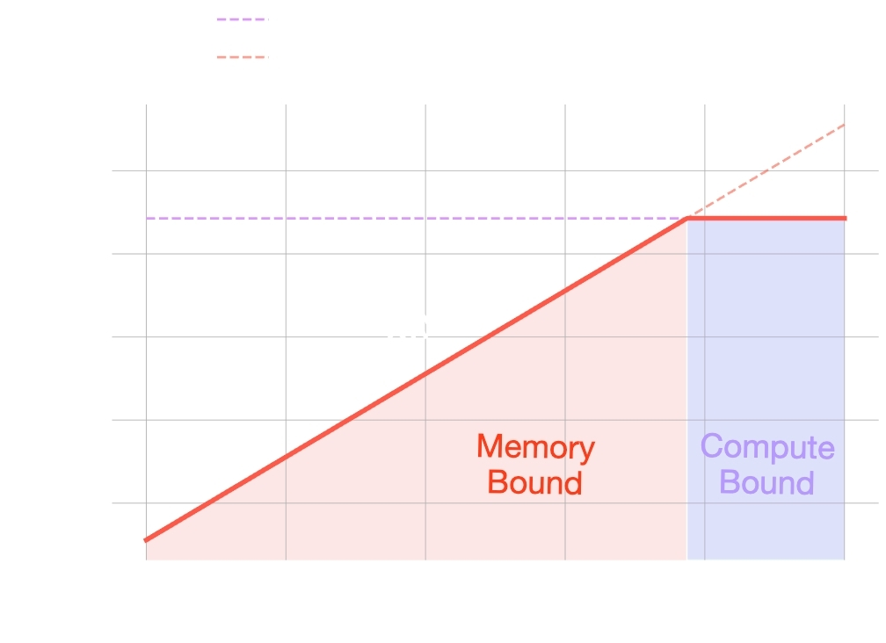

# Roofline Model —— 性能优化方向的理论指导

> [**Roofline Model**](https://dl.acm.org/doi/pdf/10.1145/1498765.1498785)

在优化 GPU 或 CPU 程序时，时常会有疑问：

- 为什么我的代码跑不快
- 是算法太复杂
- 还是显存带宽不够
- 我的优化到头了吗，我的代码还有多大的优化空间**。**

**Roofline Model** 提供了一个简洁的物理框架，将硬件的限制与软件的行为联系起来，帮助开发者确定优化的方向。

## 核心公式：性能的物理边界

Roofline 模型认为程序的性能受限于两个主要因素：

1. **峰值算力 (Peak GFLOPS)**：硬件每秒能处理的最大浮点运算次数。
2. **峰值带宽 (Peak Bandwidth)**：硬件每秒能从内存搬运的最大字节数。

程序的实际性能 $P$ 可以用以下公式描述：

$$P = \min(\text{Peak GFLOPS}, \text{Operational Intensity} \times \text{Peak Bandwidth})$$

## 关键概念：算术强度 (Operational Intensity)

这是衡量算法特性的核心指标。

- **定义**：程序中每从内存读取/写入 1 字节数据，所进行的浮点运算次数（单位：FLOPs/Byte）。
- **计算方式**：
- $\text{OI} = \frac{\text{Total Floating Point Operations}}{\text{Total Bytes Accessed}}$

如果你的 OI 很低（如向量加法），性能通常受限于**带宽**；如果 OI 很高（如密集矩阵乘法），性能则受限于**算力**。

## 图像解读：斜率与平台

x轴为OI，y轴为性能 P。

Roofline 图由两个部分组成：

- **斜坡 (Bandwidth-Bound)**：此时性能随算术强度线性增长。优化手段应集中在减少内存访问、利用缓存或使用更高效的访问模式。
- **平台 (Compute-Bound)**：此时算术强度已经足够高，硬件计算单元已经饱和。优化手段应集中在指令级并行 (ILP)、向量化 (SIMD) 或减少计算指令。
- **拐点 (Ridge Point)**：斜坡与平台的交点。它代表了要达到硬件峰值性能所需的**最小算术强度**。

## 实践分析

### 硬件参数获取（以 RTX 4000 Ada 为例）

在分析前，需查阅硬件规格：

- **Peak FP32 Performance**: 26.7 TFLOPS
- **Memory Bandwidth**: 360 GB/s
- **计算拐点**: 26700 GFLOPS / 360  GB/s = 74 FLOPs/Byte

  - *结论*：如果你的代码每读 1 字节数据进行的运算少于 74 次，你就永远无法跑满显卡的算力。

### 实战案例分析

- **向量加法 y = a + x**：

  - 2 次读 + 1 次写 = 12 字节；1 次加法运算。
  - OI = 1/ 12 = 0.08。
  - 处于极左侧的斜坡区，属于典型的**带宽受限**。
- **矩阵乘法 (GEMM)**：

  - 随着矩阵规模 N 增大，运算量量级为 O(N^3)，访存量量级为 O(N^2)。
  - OI = O(N)。
  - 随着 N 增大，OI 快速向右移动，最终进入**计算受限**区。

## Roofline model的局限性

模型指明了优化方向。但实践中，如果计算控制流复杂(如分支较多)，内存访问的pattern复杂等场景。导致硬件性能难以被发挥到极致，这会导致Roofline model方法估计的性能上限是一个很宽松的上界。

---

最后一次更新时间：`2026-08-05 14:01:27 CST`
