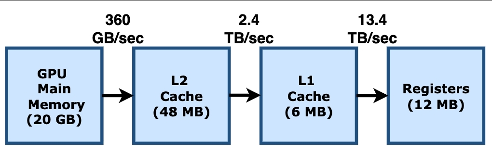

# 内存访问密集型高性能计算

在并行计算和 GPU 优化中，我们通常会遇到两类主要瓶颈：**计算限制（Compute-dominated）与访存限制（Memory-bound）**。在之前的实验中，我们主要面对的是计算密集型任务。本章我们将视角转向到访存密集型工作负载。以**波动方程模拟（Wave Simulation），**其实不用理解其具体的物理/数学含义，只需要知道我们将模拟波随时间的变化，每个时间点，每个点的值，都依赖于这个点和这个点的邻居在上个时刻的点。可见需要频繁访问非局部数据。

对应的 cpu 代码如下：

```cpp
template <typename Scene> void wave_cpu_step(float t, float *u0, float const *u1) {
    constexpr int32_t n_cells_x = Scene::n_cells_x;
    constexpr int32_t n_cells_y = Scene::n_cells_y;
    constexpr float c = Scene::c;
    constexpr float dx = Scene::dx;
    constexpr float dt = Scene::dt;

    for (int32_t idx_y = 0; idx_y < n_cells_y; ++idx_y) {
        for (int32_t idx_x = 0; idx_x < n_cells_x; ++idx_x) {
            int32_t idx = idx_y * n_cells_x + idx_x;
            bool is_border =
                (idx_x == 0 || idx_x == n_cells_x - 1 || idx_y == 0 ||
                 idx_y == n_cells_y - 1);
            float u_next_val;
            if (is_border || Scene::is_wall(idx_x, idx_y)) {
                u_next_val = 0.0f;
            } else if (Scene::is_source(idx_x, idx_y)) {
                u_next_val = Scene::source_value(idx_x, idx_y, t);
            } else {
                constexpr float coeff = c * c * dt * dt / (dx * dx);
                float damping = Scene::damping(idx_x, idx_y);
                u_next_val =
                    ((2.0f - damping - 4.0f * coeff) * u1[idx] -
                     (1.0f - damping) * u0[idx] +
                     coeff *
                         (u1[idx - 1] + u1[idx + 1] + u1[idx - n_cells_x] +
                          u1[idx + n_cells_x]));
            }
            u0[idx] = u_next_val;
        }
    }
}
```


接下来看看上述这类**访存限制（Memory-bound）**问题应该如何在GPU上进行优化。

## GPU 的内存层次结构 (Memory Hierarchy)

为了优化内存密集型应用，我们必须深入了解目标硬件的内存架构。以 **NVIDIA RTX 4000 Ada** 为例，它拥有 4 层内存层次结构：

1. **DRAM（全局内存/显存）**：容量 20 GB，带宽约 **360 GB/sec**。所有的数据通常都从这里出发，但它的速度相对最慢。
2. **L2 缓存 (L2 Cache)**：48 MB，带宽大幅提升至 **\~2.5 TB/sec**。它是所有 SM（流式多处理器）共享的，常规的全局内存读写都会经过这里。
3. **L1 缓存与共享内存 (L1 Cache / Shared Memory)**：每个 SM 拥有 128 KB 的 SRAM，带宽极高（全 GPU 聚合带宽可达 **13.4 TB/sec**）。
4. **寄存器堆 (Register File)**：每个 Warp 调度器有 64 KB 的 SRAM，速度最快。



### L1 缓存的特殊之处

与常规 CPU 不同，GPU 的 **L1 缓存并不保证跨 SM 的一致性（Not Coherent）**。因此，绝大多数常规的内存读写实际上会**绕过（Bypass）** L1 缓存。L1 在 GPU 中主要用于以下四个场景：

- 缓存 CUDA 的线程局部（Thread-local）内存（如 C 语言堆栈）。
- 缓存**只读（Read-only）**的全局内存（可以通过给指针加 `const restrict` 或使用 `__ldg` 内联指令来触发）。
- 缓存编译器认为未来可能发生变化但仍值得缓存的数据。
- **作为软件管理的 Scratchpad（即 CUDA 中的 Shared Memory）**：这是我们需要在代码中显式分配和管理的一块超高速存储。

### 各级存储访问延迟的直观感受

在更底层（PTX 虚拟汇编）的视角下，GPU 提供了不同的 Load 指令来控制缓存行为：

- `ld.global.ca`：缓存在所有层级（L1 和 L2）。
- `ld.global.cg`：只缓存在 L2 缓存（绕过 L1）。
- `ld.global.cv`：不缓存（每次读取都会使得 L2 对应的 cache line 失效并重新拉取）。

可以利用这些命令结合实验感受各级存储访问的延迟差距。

```cpp

__attribute__((optimize("O0"))) __global__ void l1_mem_latency(
    unsigned long *time_start,
    unsigned long *time_end,
    data_type *array_1,
    data_type *array_2) {
    unsigned long start_time, end_time;
    data_type value1 = 0.0f, result;
    unsigned long temp_addr;

    asm volatile(
        // L1 cache setup - load a zero and create offset address
       "ld.global.ca.u64 %0, [%5];\n\t"
        "add.u64 %0, %0, %5;\n\t"

        // warm-up
        "ld.global.ca.f32 %2, [%0];\n\t"

        "mov.u64 %1, %%clock64;\n\t"
        "ld.global.ca.f32 %2, [%0];\n\t"
        "mov.u64 %4, %%clock64;\n\t"

        "st.global.f32 [%5], %2;\n\t"
        : "=l"(temp_addr), "=l"(start_time), "=f"(result), "+f"(value1), "=l"(end_time)
        : "l"(array_2)
        : "memory");

    *time_start = start_time;
    *time_end = end_time;
    array_1[0] = result;
}

////////////////////////////////////////////////////////////////////////////////
// L2 Cache Memory Latency

__attribute__((optimize("O0"))) __global__ void l2_mem_latency(
    unsigned long *time_start,
    unsigned long *time_end,
    data_type *array_1,
    data_type *array_2) {
    unsigned long start_time, end_time;
    data_type value1 = 0.0f, result;
    unsigned long temp_addr;

    asm volatile(
        // L2 cache setup - load a zero and create offset address
        "ld.global.cg.u64 %0, [%5];\n\t"
        "add.u64 %0, %0, %5;\n\t"
        "membar.gl;\n\t"

        // warm-up（进入 L2）
        "ld.global.cg.f32 %2, [%0];\n\t"

        "mov.u64 %1, %%clock64;\n\t"
        "ld.global.cg.f32 %2, [%0];\n\t"
        "mov.u64 %4, %%clock64;\n\t"

        "st.global.f32 [%5], %2;\n\t"
        : "=l"(temp_addr), "=l"(start_time), "=f"(result), "+f"(value1), "=l"(end_time)
        : "l"(array_2)
        : "memory");

    *time_start = start_time;
    *time_end = end_time;
    array_1[0] = result;
}

////////////////////////////////////////////////////////////////////////////////
// Global Memory Latency

__attribute__((optimize("O0"))) __global__ void global_mem_latency(
    unsigned long *time_start,
    unsigned long *time_end,
    volatile data_type *array_1,
    volatile data_type *array_2) {
    unsigned long start_time, end_time;
    data_type value1 = 0.0f, result;

    asm volatile(
        // Measure memory load latency directly - no warm-up access
        "membar.gl;\n\t"
        "mov.u64 %0, %%clock64;\n\t"

        "ld.global.cv.f32 %1, [%3];\n\t"

        "mov.u64 %4, %%clock64;\n\t"
        "st.global.f32 [%3], %1;\n\t"
        : "=l"(start_time), "=f"(result), "+f"(value1), "+l"(array_2), "=l"(end_time)
        :
        : "memory");

    *time_start = start_time;
    *time_end = end_time;
    array_1[0] = result;
}
```

```cpp
./mem-latency 
global_mem_latency latency =    475 cycles
l2_mem_latency latency =        6 cycles
l1_mem_latency latency =        6 cycles
```

## 内存访问合并

**同一 Warp（32 个cuda线程）的内存访问应当是连续的**。

- **Coalesced Load（合并加载）**：当 Warp 内的各个线程读取连续的内存地址时，GPU 可以通过单次（或极少数几次）内存事务（Transaction）取回所有数据。
- **Non-coalesced Load（非合并加载/步长加载）**：如果各个线程访问的地址步长很大（Stride），内存请求会被打散成大量的离散事务，导致内存延迟飙升，带宽利用率断崖式下跌。


## Bank conflict

在 GPU 的 **Shared Memory（共享内存）** 优化中，**Bank Conflict（存储体冲突）** 是最常见的性能杀手之一。

为了实现极高的带宽，Shared Memory 被平均分成 **32 个等大小**的内存模块，称为 **Banks**（存储体）。

- 在逻辑上，连续的 4 字节（`float` 或 `int32`）被轮流映射到这 32 个 Bank 中。
- **规则**：第 n 个地址映射到第 n % 32 个 Bank。

在一个 Warp（32 个线程）执行内存指令时，如果所有线程访问的地址分别指向 **32 个不同的 Banks**，那么这些访问可以 **100% 并行**完成。

如果 Warp 中有两个或更多线程请求的地址落在 **同一个 Bank** 中，这些请求就无法同时处理。

硬件必须将这些冲突的请求**串行化（Serializing）**。例如，如果有 2 个线程冲突，耗时就会翻倍（2-way conflict）。

最典型的例子是**跨步访问（Strided Access）**：

- 如果线程 i 访问 `shared_data[i * 2]`，那么线程 0 访问 Bank 0，线程 1 访问 Bank 2... 看起来没问题。
- 但如果步长是 32 的倍数（例如访问二维数组的列，且行宽是 32），所有 32 个线程都会请求**同一个 Bank**，导致严重的 32-way conflict，性能瞬间跌至 1/32。

### 优化技巧

最经典的技巧是 **Padding（填充）**：

- 在定义二维 Shared Memory 数组时，故意把列宽增加 1。
- **例如**：原本是 `shared float data[32][32]`，改为 `data[32][33]`。
- **原理**：这样每一行的起始地址在 Bank 中的偏移都会错开 1 位，原本纵向对齐到同一个 Bank 的元素，现在会分布在不同的 Bank 中，从而完美消除冲突。


## 内存访问密集型高性能实战

### Naive 实现

先看 naive gpu实现

```cpp
template <typename Scene>
__global__ void wave_gpu_naive_step(
    float t,
    float *u0,      /* pointer to GPU memory */
    float const *u1 /* pointer to GPU memory */
) {
    constexpr int32_t n_cells_x = Scene::n_cells_x;
    constexpr int32_t n_cells_y = Scene::n_cells_y;
    constexpr float c = Scene::c;
    constexpr float dx = Scene::dx;
    constexpr float dt = Scene::dt;

    const int idx_x = blockIdx.x * blockDim.x + threadIdx.x;
    const int idx_y = blockIdx.y * blockDim.y + threadIdx.y;
    const int idx = idx_y * n_cells_x + idx_x;

    if (idx_x >= n_cells_x || idx_y >= n_cells_y) {
        return;
    }

    bool is_border =
        (idx_x == 0 || idx_x == n_cells_x - 1 || idx_y == 0 ||
            idx_y == n_cells_y - 1);
    float u_next_val;
    if (is_border || Scene::is_wall(idx_x, idx_y)) {
        u_next_val = 0.0f;
    } else if (Scene::is_source(idx_x, idx_y)) {
        u_next_val = Scene::source_value(idx_x, idx_y, t);
    } else {
        constexpr float coeff = c * c * dt * dt / (dx * dx);
        float damping = Scene::damping(idx_x, idx_y);
        u_next_val =
            ((2.0f - damping - 4.0f * coeff) * u1[idx] -
                (1.0f - damping) * u0[idx] +
                coeff *
                    (u1[idx - 1] + u1[idx + 1] + u1[idx - n_cells_x] +
                    u1[idx + n_cells_x]));
    }
    u0[idx] = u_next_val;
}

template <typename Scene>
std::pair<float *, float *> wave_gpu_naive(
    float t0,
    int32_t n_steps,
    float *u0, /* pointer to GPU memory */
    float *u1  /* pointer to GPU memory */
) {
    const int n_cells_x = Scene::n_cells_x;
    const int n_cells_y = Scene::n_cells_y;

    dim3 blockDim(block_dim_x, block_dim_y);
    dim3 gridDim(
        (n_cells_x + block_dim_x - 1) / block_dim_x,
        (n_cells_y + block_dim_y - 1) / block_dim_y
    );

    for (int32_t step = 0; step<n_steps; ++step) {
        float t = t0 + step * Scene::dt;
        wave_gpu_naive_step<Scene><<<gridDim, blockDim>>>(t, u0, u1);
        std::swap(u0, u1);
    }

    return {u0, u1};
}
```

最直观的 GPU 实现方式是将上述算法直接翻译为 Kernel 函数：

- 为网格中的每个像素分配一个线程。
- 每个线程在 Kernel 内从 Global Memory 读取自己的当前值、历史值和四个邻居的值。
- 计算结果，写回 Global Memory。

**痛点**：对于计算每个像素点，我们需要从 Global Memory 读取至少 5 个值并写入 1 个值。在这个过程中，邻居像素被相邻线程重复读取了极多次。面对极高的全局内存带宽压力，计算单元被迫处于饥饿状态等待数据。


### 共享内存优化(Shared Memory)

**核心思想：**

1. **分块（Tiling）加载**：将画面划分为若干个 2D Block。每个 Block 启动时，全体线程协作，将当前 Block 及其“光晕区（Halo/Ghost cells，即边界邻居数据）”一次性从全局内存加载到该 Block 专属的共享内存中。
2. **高速计算**：所有的上下左右邻居数据现在都位于延迟极低、带宽极高的 Shared Memory 内。线程在这里完成复杂的 Stencil 模板计算。
3. **写回**：计算完成后，再统一将结果写回全局内存。

需要精心设计：

- 数据在 Shared Memory 和 Register 之间的分布。
- 为了防范越界访问，Shared Memory 的大小通常需要比计算网格稍大一圈（`blockDim + 2*halo`）。
- 在 Block 内的加载阶段和计算阶段之间，必须使用 `__syncthreads()` 进行 Block 级别的屏障同步，以防数据还没加载完就开始计算。

```java

template <typename Scene>
__global__ void wave_gpu_shmem_multistep(
    float t0,
    int32_t steps,
    float *u0,      /* pointer to GPU memory */
    float *u1,      /* pointer to GPU memory */
    float *dampings, /* pointer to GPU memory */
    float *extra1, /* pointer to GPU memory */
    const int pixel_per_thread
) {
    (void)extra1;
    int tx = threadIdx.x;
    int ty = threadIdx.y;

    int bx = blockIdx.x * blockDim.x * pixel_per_thread;
    int by = blockIdx.y * blockDim.y * pixel_per_thread;

    const int tile_width = blockDim.x * pixel_per_thread + 2 * steps;
    const int tile_height = blockDim.y * pixel_per_thread + 2 * steps;

    constexpr float c = Scene::c;
    constexpr float dx = Scene::dx;
    constexpr float dt = Scene::dt;

    extern __shared__ float shmem[];
    float* sh_u0 = shmem;
    float* sh_u1 = shmem + tile_width * tile_height;
    float* sh_dampings = shmem + 2 * tile_width * tile_height;

    // load to share mem
    for (int py = ty; py < tile_height; py += blockDim.y) {
        for (int px = tx; px < tile_width; px += blockDim.x) {
            int gx = bx + px - steps;
            int gy = by + py - steps;

            float v0 = 0.0f, v1 = 0.0f, d = 0.0f;
            if (gx >= 0 && gx < Scene::n_cells_x && gy >= 0 && gy < Scene::n_cells_y) {
                const int idx = gy * Scene::n_cells_x + gx;
                v0 = u0[idx];
                v1 = u1[idx];
                d = dampings[idx];
            }
            int s_idx = py * tile_width + px;
            sh_u0[s_idx] = v0;
            sh_u1[s_idx] = v1;
            sh_dampings[s_idx] = d;
        }
    }
    __syncthreads();

    constexpr float coeff = c * c * dt * dt / (dx * dx);

    // compute through share mem
    for (int i=0; i<steps; ++i) {
        float t = t0 + i * Scene::dt;
        int shrink = i;

        for (int y = ty+1+shrink; y<tile_height-1-shrink; y += blockDim.y) {
            for (int x = tx+1+shrink; x<tile_width-1-shrink; x += blockDim.x) {
                int gx = bx + x - steps;
                int gy = by + y - steps;
                int idx = y * tile_width + x;
                bool is_boder = (gx <= 0 || gx >= Scene::n_cells_x - 1 || gy <= 0 || gy >= Scene::n_cells_y - 1);
                if (is_boder || Scene::is_wall(gx, gy)) {
                    sh_u0[y * tile_width + x] = 0.0f;
                } else if (Scene::is_source(gx, gy)) {
                    sh_u0[y * tile_width + x] = Scene::source_value(gx, gy, t);
                } else {
                    float damping = sh_dampings[idx];
                    float u_next_val =
                        ((2.0f - damping - 4.0f * coeff) * sh_u1[idx] -
                            (1.0f - damping) * sh_u0[idx] +
                            coeff *
                                (sh_u1[idx - 1] + sh_u1[idx + 1] + sh_u1[idx - tile_width] +
                                sh_u1[idx + tile_width]));
                    sh_u0[idx] = u_next_val;
                }
            }
        }
        float* tmp = sh_u0;
        sh_u0 = sh_u1;
        sh_u1 = tmp;
        __syncthreads();
    }

    // write back
    for (int py = ty; py < tile_height - 2 * steps; py += blockDim.y) {
        for (int px = tx; px < tile_width - 2 * steps; px += blockDim.x) {
            int gx = bx + px;
            int gy = by + py;
            if (gx < Scene::n_cells_x  && gy < Scene::n_cells_y) {
                int x = px + steps;
                int y = py + steps;
                int g_idx = gy * Scene::n_cells_x + gx;
                int idx = y * tile_width + x;
                u0[g_idx] = sh_u0[idx];
                u1[g_idx] = sh_u1[idx];
            }
        }
    }
}

template <typename Scene>
__global__ void precompute_damping(float *dampings) {
    int idx_x = blockIdx.x * blockDim.x + threadIdx.x;
    int idx_y = blockIdx.y * blockDim.y + threadIdx.y;
    if (idx_x < Scene::n_cells_x && idx_y < Scene::n_cells_y) {
        int idx = idx_y * Scene::n_cells_x + idx_x;
        dampings[idx] = Scene::damping(idx_x, idx_y);
    }
}


template <typename Scene>
std::pair<float *, float *> wave_gpu_shmem(
    float t0,
    int32_t n_steps,
    float *u0,     /* pointer to GPU memory */
    float *u1,     /* pointer to GPU memory */
    float *extra0, /* pointer to GPU memory */
    float *extra1  /* pointer to GPU memory */
) {
    static constexpr int tile_size = 32;
    static constexpr int pixel_per_thread = 2;
    assert(tile_size % pixel_per_thread == 0);
    static constexpr int steps = 8;

    const int share_mem_bytes =
        3 * sizeof(float) * (tile_size + 2 * steps) * (tile_size + 2 * steps);
    CUDA_CHECK(cudaFuncSetAttribute(
        wave_gpu_shmem_multistep<Scene>,
        cudaFuncAttributeMaxDynamicSharedMemorySize,
        share_mem_bytes));

    {
        dim3 pre_block(block_dim_x, block_dim_y);
        dim3 pre_grid(
            (Scene::n_cells_x + pre_block.x - 1) / pre_block.x,
            (Scene::n_cells_y + pre_block.y - 1) / pre_block.y);
        precompute_damping<Scene><<<pre_grid, pre_block>>>(extra0);
    }

    dim3 blockDim(tile_size / pixel_per_thread, tile_size / pixel_per_thread);
    dim3 gridDim(
        (Scene::n_cells_x + tile_size - 1) / tile_size,
        (Scene::n_cells_y + tile_size - 1) / tile_size);

    for (int step_i = 0; step_i < n_steps; step_i += steps) {
        int32_t this_steps = std::min<int32_t>(steps, n_steps - step_i);
        float t = t0 + step_i * Scene::dt;
        wave_gpu_shmem_multistep<Scene><<<gridDim, blockDim, share_mem_bytes>>>(
            t,
            this_steps,
            u0,
            u1,
            extra0,
            extra1,
            pixel_per_thread);
    }
    return {u0, u1};
}
```

主要优化思路有：

- **时间平铺 (Temporal Blocking / Time Tiling)**

  - 在传统的实现中，每计算一个时间步都要启动一次 Kernel，并读写全局内存。而这里在一个 Kernel 调用中连续计算了 `steps`（通常为 8）个时间步。
  - 通过在共享内存中暂存中间状态，数据被加载一次后，在退出 Kernel 前被反复使用了多次。这极大地提高了**算术强度（Arithmetic Intensity）**，将原本“访存受限”的任务向“计算受限”拉动。
  - **实现细节**：
  
    - **Halo 区域加载**：为了能计算多步，加载的 `tile` 大小比计算区域大出一圈（`2 * steps`），这一圈被称为“光晕区（Halo）”。
    - **收缩计算 (Shrinking Window)**：每步计算后，由于边界处缺少更外围的数据，可计算的范围会向内收缩 1 像素，因此代码中使用了 `shrink` 变量。
- 共享内存 (Shared Memory) 的显式管理

  - 使用 `shared` 关键字分配了一块片上缓存（Scratchpad memory）。
  - **优化原理**：共享内存的访问延迟比全局内存（DRAM）低 100 倍左右。
  - **动态分配**：通过 `extern shared float shmem[]` 动态分配空间，并在运行时通过 `cudaFuncSetAttribute` 设置最大可用容量。这使得代码能根据 `tile_size` 和 `steps` 灵活调整内存占用。
- 多像素/线程 (Pixels Per Thread)

  - 通过 `pixel_per_thread` 参数，让一个线程负责计算多个网格点。
  - **减少索引计算开销**：多个像素可以共享一部分坐标计算逻辑。
  - **寄存器复用**：在计算循环中，某些中间变量可以保留在寄存器中供多个相邻像素使用。
  - **指令并行 (ILP)**：增加单个线程的工作量可以帮助隐藏指令流水线延迟。
- 内存合并访问 (Cooperative Loading & Coalescing)

  - 加载阶段使用 `for (int px = tx; px < tile_width; px += blockDim.x)`。这种写法确保了同一个 Warp 内的线程在访问全局内存（`u0`, `u1`）时地址是连续的，从而触发 **Memory Coalescing（内存合并）**，最大化利用显存带宽。
- 指针交换 (Ping-Pong Buffer)

  - 在 `steps` 循环内部，通过 `float* tmp = sh_u0; sh_u0 = sh_u1; sh_u1 = tmp;` 交换共享内存指针。波动方程需要前两时刻的状态推导下一时刻。通过交换指针，避免了昂贵的数据拷贝（`memcpy`），仅仅通过修改地址引用就完成了状态更新。
- 预计算 (Precomputation)

  - 使用 `precompute_damping` 核函数提前计算阻尼系数。由于 `Scene::damping(gx, gy)` 可能涉及复杂的数学运算（如 `exp`, `sqrt`），且阻尼系数在模拟过程中是不变的，将其预计算并存储在显存中（并在主 Kernel 中读入 Shared Memory），可以显著减少主循环内的计算压力。

### 分析与对比

```bash
Small scale tests (on scene 'DoubleSlitSmallScale'):
  CPU sequential implementation:
    run time: 603.79 ms

  GPU naive implementation:
    run time: 4.30 ms
    correctness: 3.13e-06 relative RMSE

  GPU shared memory implementation:
    run time: 1.85 ms
    correctness: 4.04e-06 relative RMSE

  CPU -> GPU naive speedup: 140.52x
  CPU -> GPU shared memory speedup: 326.59x
  GPU naive -> GPU shared memory speedup: 2.32x

Large scale tests (on scene 'DoubleSlit'):
  GPU naive implementation:
    run time: 2363.80 ms

  GPU shared memory implementation:
    run time: 1500.22 ms
    correctness (w.r.t. GPU naive): 9.01e-05 relative RMSE

  GPU naive -> GPU shared memory speedup: 1.58x
```

---

最后一次更新时间：`2026-08-05 16:12:21 CST`
