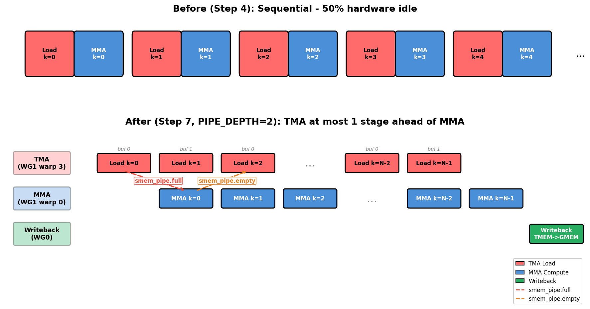

# TIRx 与高性能GEMM (下)

## 从 Warp Specialization 到 Cluster：GEMM 如何逼近 cuBLAS

读这章时，一个容易产生的疑问是：既然已经有了 TMA 和双缓冲，为什么还说没有真正 overlap？原因是当前代码仍由一个 warpgroup 顺序推进 load、MMA 和 store。它具备了 overlap 所需的物理结构，但还没有把不同角色分给不同 warpgroup。下一章的 warp specialization 会把 producer、MMA consumer、writeback 等角色拆开，让 TMA load 和 Tensor Core compute 在时间上真正重叠。

因此，这章更像是从“正确 kernel”到“可优化 kernel”的结构重建。它把数据搬运从线程指令流中解耦出来，把 SMEM 从单缓冲变成可复用 stage ring，把 CTA 从一次性 worker 变成长生命周期 worker。没有这些结构，后续再谈 warp specialization 和 cluster 只会让状态空间爆炸；有了这些结构，下一步优化才有明确落点。

前一章把 GEMM kernel 从同步搬运推进到了 TMA、双缓冲和 persistent scheduler。到了这一章，优化重点不再是“能不能异步搬数据”，而是“谁在搬、谁在算、谁在写回，以及这些角色如何安全交接资源”。原始 GEMM 公式没有变，变化的是执行组织：从一个 CTA 内部的 warp 分工，扩展到两个 CTA 的 cluster 协作，再扩展到多个 MMA consumer 复用同一批片上数据。

<callout emoji="📌">
这章的主线可以用三个词概括：Scope、Layout、Dispatch。
- Scope 说明计算由哪个层级执行：warp、warpgroup、CTA，还是 CTA cluster。
- Layout 说明数据如何放在 SMEM、TMEM 和每线程寄存器视图里。
- Dispatch 说明具体走哪条硬件路径：TMA 负责搬运，tcgen05 负责 Tensor Core MMA，barrier 负责资源交接。
</callout>

## 为什么 TMA 之后还需要 warp specialization

TMA 已经能把 global memory 到 shared memory 的搬运从普通线程 load 中解耦出来，但这并不自动等于 load、MMA 和 store 已经重叠。如果同一组线程仍然按顺序推进“发 TMA、等 TMA、做 MMA、读 TMEM、写回”，那么 kernel 只是具备了异步能力，时间线上仍然像串行状态机。

Step 7 的关键改变，是把角色拆开：TMA producer 负责把下一批 A/B tile 搬进 SMEM，MMA consumer 负责从 SMEM 读数据并向 TMEM 累加，writeback warpgroup 负责把 TMEM 结果搬回寄存器、转换类型，再写到 D。这样一来，producer 可以准备下一轮数据，consumer 可以消耗上一轮数据，writeback 可以收尾更早完成的输出 tile。

| 交接点 | 含义 | 保护的资源 |
|-|-|-|
| tma2mma | TMA 已经把当前 stage 搬完，MMA 可以读取 SMEM | SMEM 输入 tile 的可见性 |
| mma2tma | MMA 已经消费当前 stage，TMA 可以复用这块 SMEM | SMEM stage 的生命周期 |
| mma2ld | MMA 已经完成输出累加，writeback 可以读取 TMEM | TMEM accumulator 的读时机 |
| ld2mma | writeback 已经读完 TMEM，下一轮 MMA 可以复用 TMEM | TMEM accumulator 的复用时机 |

这里的难点不是多放几个 barrier，而是每个 barrier 都对应一个资源生命周期。`PipelineState` 中的 stage 和 phase 用来描述双缓冲 ring 当前走到哪里；如果 phase 初始化错了，producer 和 consumer 可能都在等待对方先到达，最终表现为死锁。

## `warpgroup_sync(10)` 是局部同步，不是 CTA 同步

writeback 阶段有一个容易忽略的同步问题：Warpgroup 0 的 128 个线程会先把各自负责的寄存器片段写入 `Dsmem`，然后由一个线程发起 TMA store。此时不能使用 `cta_sync()`，因为其他 warpgroup 正在执行 producer 或 MMA consumer 分支，它们不会到达这个同步点，使用 CTA 级同步会直接死锁。

`T.cuda.warpgroup_sync(10)` 会降到 PTX 的命名 barrier，同一个 CTA 里有编号 0 到 15 的 barrier slot。数字 10 不是 warpgroup id，而是同步槽位 id；之所以同步的是 Warpgroup 0，是因为只有 Warpgroup 0 的 128 个线程会执行到这行代码。Step 9 有两个 writeback warpgroup，所以会用 `wg_id + 10` 分配到 10 和 11，避免两个独立同步混在同一个计数器里。

## Step 8：两个 CTA 组成 cluster，扩大片上复用半径

Step 8 把合作范围从一个 CTA 扩展到两个 CTA。每个 CTA 仍然加载自己负责的 A/B slice，但 MMA 不再只消费本 CTA 的数据，而是通过 cluster 机制读取 peer CTA 的 shared memory，合作计算一个更大的输出 tile。直观上，输入搬运量约扩大 2 倍，但输出 tile 从 `128x128` 扩到 `256x256`，元素数量扩大 4 倍；同一批 staged operands 被用于更多乘加，片上数据复用率提高。

这也是 `cta_group=2` 的意义：它不是“第 2 个 CTA”的编号，而是告诉 tcgen05/TMA/barrier 这次操作处在双 CTA 协作模式下。配套的 `cta_mask=3` 表示二进制 `11`，也就是两个 CTA 都要收到对应的 barrier 到达通知。为了让跨 CTA 的交接更可控，代码会使用 `remote_view(0)` 把关键到达汇报到 CTA 0 的 barrier 上；例如 `ld2mma.init(128 * CTA_GROUP)` 在 `CTA_GROUP=2` 时等待 256 个 writeback 线程到达，确认两个 CTA 都不再使用同一块 TMEM 后，下一轮 MMA 才能复用。

调度器也要跟着从“每个 SM 一个 persistent worker”变成“每个 cluster 一个 persistent worker”。因此 Step 8 中 `num_clusters` 通常写成 `SM_COUNT // CTA_GROUP`：一个 cluster 占用两个 CTA 的协作资源，逻辑 worker 数自然按 cluster 数而不是 CTA 数来计算。

## Step 9：增加第二个 MMA consumer，让 B tile 被更多次使用

Step 9 保留 Step 8 的双 CTA cluster，但在 cluster 内增加第二个 MMA consumer。两个 consumer 处理不同的 M 行块，却共享相同的 B tile；cluster 的有效输出从 `256x256` 进一步扩到 `512x256`。这一步选择复用 B 而不是 A，是因为两个 consumer 都在计算同一批 N 列上的输出，只是 M 行不同，所以 B 是天然公共输入，而 A 必须随 M 行块变化。

这一步带来的代码复杂度主要体现在资源隔离。两个 consumer 需要不同的 A 起点、不同的 TMEM accumulator 范围，以及不同的 writeback 同步槽位；但它们可以共用同一个 staged B tile。换句话说，Step 9 不是简单地“多开一个算子”，而是在保证 barrier 和 TMEM 生命周期不混淆的前提下，让昂贵的 B 搬运服务更多 MMA。

## 性能结果：优化来自多层协同，而不是单个技巧

原文在 NVIDIA B200 上测试 `M=N=K=4096`、fp16 输入、锁频、每个版本 1,000 次计时。结果显示，最终 Step 9 与 cuBLAS reference 达到同样的 0.094 ms。

| 版本 | 关键机制 | 耗时 | 相对 Step 1 |
|-|-|-|-|
| Step 1 | 同步 load 加 MMA | 70 ms | 1x |
| Step 3 | 空间 tiling 覆盖完整矩阵 | 53.6 ms | 约 1.3x |
| Step 4 | TMA 异步搬运 | 0.49 ms | 约 142x |
| Step 7 | persistent scheduler 加 warp specialization | 0.23 ms | 约 309x |
| Step 8 | two-CTA cluster cooperative MMA | 0.104 ms | 约 676x |
| Step 9 | multi-consumer 复用 B tile | 0.094 ms | 约 744x |
| cuBLAS | 参考实现 | 0.094 ms | 约 744x |

从局部增益看，Step 4 到 Step 7 主要靠软件流水、persistent scheduling 和 warp specialization，把 TMA 搬运、Tensor Core 计算、writeback 真正错开；Step 7 到 Step 8 靠 cluster 扩大 A/B operand 的复用半径；Step 8 到 Step 9 则靠第二个 consumer 进一步摊薄 B tile 的搬运成本。最终性能接近 cuBLAS，不是因为某一条指令神奇地快，而是因为数据移动、执行重叠和片上复用三件事同时对齐了。

## 读这类 kernel 时的三个抓手

第一，看 Scope：每个分支到底由哪个 warp、哪个 warpgroup、哪个 CTA 或哪个 cluster 执行。很多同步语句的含义都取决于“谁会到达这里”，例如 `warpgroup_sync(10)` 只对实际执行到该分支的 128 个线程成立。

第二，看 Layout：SMEM stage、TMEM accumulator、每线程寄存器视图并不是普通数组，它们描述的是硬件资源如何被线程集合共同解释。理解 layout，才能解释为什么每个线程只持有一小段寄存器，却能 collectively 表示完整 tile。

第三，看 Dispatch：`Tx.copy`、`Tx.gemm_async`、barrier arrive/wait 这些 TIRx 写法背后分别对应 TMA、tcgen05 和 mbarrier/命名 barrier。高级 GEMM kernel 的核心不是把这些 API 串起来，而是让每条硬件路径在正确的 scope 和生命周期里运行。

因此，这一章真正展示的是 Blackwell GEMM 优化的系统性：TMA 解决供数方式，warp specialization 解决时间重叠，cluster 解决跨 CTA 复用，multi-consumer 解决同一 operand 的更高复用密度。把这些层次连起来看，才能理解一个教学 kernel 如何一步步逼近工业级 GEMM 实现。

---

最后一次更新时间：`2026-08-12 20:23:36 CST`

原文链接：[https://fangpin.github.io/gpu-hpc-book/#/chapters/11-tirx-gemm.md](https://fangpin.github.io/gpu-hpc-book/#/chapters/11-tirx-gemm.md)
