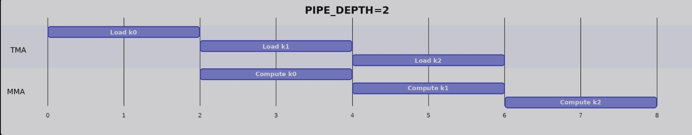

# TIRx 与高性能GEMM (上)

```{contents} 本页目录
---
depth: 2
local: true
---
```

GEMM 是现代 MLSys 里最值得认真对待的基础 kernel。线性层、attention projection，以及不少 convolution lowering 之后的算子，最终都会把 GPU 时间花在矩阵乘上。也正因为它重要，GEMM 的优化不能一开始就把 TMA、pipeline、warp specialization、cluster 和 Tensor Core 调度全部混在一起。更稳妥的路线，是先建立一个可信的正确版本，再让每一轮优化只改变一个明确的契约。

## 从 GEMM 公式到数据路径

对于矩阵乘 $D = A B^\top$。其中 `A` 的形状是 `M x K`，`B` 的形状是 `N x K`，输出 `D` 的形状是 `M x N`。这里的转置不是额外做一次数据搬运，而是来自权重矩阵的存储方式：`B` 被组织成 `N` 行、每行长度为 `K`，沿着 `K` contraction 时，自然就是在计算 `A @ B.T`。

真正决定 kernel 写法的，不只是数学公式，而是数据会经过哪些硬件层级。Blackwell 上的基础 GEMM 路径可以概括为：operand tile 从 GMEM 进入 SMEM，Tensor Core MMA 从 SMEM 读取 A/B 并把累加结果写入 TMEM，最后 epilogue 再把 TMEM 结果读到寄存器，转换精度后写回 GMEM。

| 阶段 | 数据移动 | TIRx / PTX 关键点 | 正确性约束 |
|-|-|-|-|
| 加载 operand | GMEM -> SMEM | `Tx.cta.copy` | 所有线程写完 SMEM 后，MMA 才能读取完整 tile。 |
| 执行 MMA | SMEM -> TMEM | `Tx.gemm_async`，`dispatch="tcgen05"` | 只有一个 elected issuer 发起 tile op，但硬件执行的是 cooperative MMA。 |
| 等待完成 | TMEM accumulator readiness | `tcgen05.commit` 与 `mbarrier.try_wait` | 复用 barrier 时必须维护 phase，否则 wait 可能过早返回。 |
| 写回输出 | TMEM -> register -> GMEM | `Tx.wg.copy_async`，`tcgen05.wait.ld`，`Tx.copy` | TMEM load 完成后才能读寄存器，并在写回前完成 fp32 到 fp16 的 cast。 |

## Step 1：单 tile GEMM，先把完整路径跑通

最小但仍然覆盖完整硬件路径的版本，是计算一个 `128 x 128` 输出 tile，并让 `K = 64`。这个版本没有 K-loop，也没有二维 grid；它只是让一个 warpgroup 顺序完成分配、加载、MMA、等待、写回和释放。它的价值不在性能，而在于它把后续所有优化都会复用的数据路径固定下来。

**共享内存与 TMEM 元数据分配。**Kernel 首先用 `T.SMEMPool` 分配 TMEM 地址槽、mbarrier，以及 A/B 两个 shared-memory tile。`pool.move_base_to(1024)` 把大块 operand tile 放到更干净的地址边界上，而 `tma_shared_layout` 生成的 layout 则让 SMEM 中的数据能被后续 TMA 和 `tcgen05.mma` 直接消费。

```python
import tvm
from tvm.script import tirx as T
from tvm.script.tirx import tile as Tx
from tvm.tirx.cuda.operator.tile_primitive.tma_utils import tma_shared_layout, SwizzleMode
from tvm.tirx.layout import TileLayout, S, TLane, TCol, tid_in_wg

pool = T.SMEMPool()
tmem_addr = pool.alloc((1,), "uint32")
mma_bar = pool.alloc((1,), "uint64", align=8)
pool.move_base_to(1024)
Asmem = pool.alloc((BLK_M, BLK_K), a_type, layout=A_layout)
Bsmem = pool.alloc((BLK_N, BLK_K), b_type, layout=B_layout)
pool.commit()
```

**线程驱动的同步加载。**第一版没有使用 TMA，而是让 CTA 内线程合作把 A/B 从 GMEM 拷到 SMEM。这里的 `T.cuda.cta_sync()` 不能省略：它既等待所有线程完成拷贝，也保证这些 shared-memory 写入对后续 MMA 可见。

```python
Tx.cta.copy(Asmem[:, :], A[m_st:m_st + BLK_M, :])
Tx.cta.copy(Bsmem[:, :], B[n_st:n_st + BLK_N, :])
T.cuda.cta_sync()
```

**一个线程发起，不等于一个线程计算。**MMA dispatch 由 warp 0 中一个被 `T.ptx.elect_sync()` 选出的 lane 发起。这一点很容易误读：单个 issuer 只是在发起 tile operation，真正的乘加仍然由硬件以 cooperative 方式完成。`Tx.gemm_async` 会根据 operand 与 accumulator 的 tile 形状 lowering 到一组 `tcgen05.mma` 指令；如果 128 个线程都发起同一个 op，只会把同一份工作重复提交 128 次。

```python
if warp_id == 0:
    if T.ptx.elect_sync():
        Tx.gemm_async(
            tmem[:, :BLK_N], Asmem[:, :], Bsmem[:, :],
            accum=False, dispatch="tcgen05", cta_group=1
        )
        T.ptx.tcgen05.commit(mma_bar.ptr_to([0]), cta_group=1)
```

**从 TMEM 到寄存器，再写回 GMEM。**MMA 结果先以 fp32 accumulator 形式留在 TMEM。写回时，warpgroup 通过 `Tx.wg.copy_async` 把一个 `128 x 128` tile 读到寄存器视图中，再等待 `tcgen05.wait.ld()`。每个线程持有输出 tile 的一行，完成 fp32 到 fp16 的转换后写入自己的全局输出行。

```python
Dreg = T.alloc_local((BLK_N,), acc_type)
Dreg_f16 = T.alloc_local((BLK_N,), d_type)
Dreg_wg = Dreg.view(
    128, BLK_N,
    layout=TileLayout(S[(128, BLK_N) : (1@tid_in_wg, 1)])
)

Tx.wg.copy_async(Dreg_wg[:, :], tmem[:, :BLK_N])
T.ptx.tcgen05.wait.ld()
Tx.cast(Dreg_f16[:], Dreg[:])
m_thr = T.meta_var(m_st + warp_id * 32 + lane_id)
Tx.copy(D[m_thr, n_st : n_st + BLK_N], Dreg_f16[:])
```

完整的kernel

```python
def hgemm_v1(M, N, K):
    a_type = tvm.DataType("float16")
    b_type = tvm.DataType("float16")
    d_type = tvm.DataType("float16")
    acc_type = tvm.DataType("float32")

    BLK_M, BLK_N, BLK_K = 128, 128, 64
    # MMA_M/MMA_N/MMA_K document the underlying hardware MMA tile; they are not
    # passed to gemm_async (which derives the MMA shape from the operand and
    # accumulator tiles), so the later steps omit them.
    MMA_M, MMA_N, MMA_K = 128, 128, 16

    A_layout = tma_shared_layout(a_type, SwizzleMode.SWIZZLE_128B_ATOM, (BLK_M, BLK_K))
    B_layout = tma_shared_layout(b_type, SwizzleMode.SWIZZLE_128B_ATOM, (BLK_N, BLK_K))

    @T.prim_func
    def kernel(
        A: T.Buffer((M, K), a_type),
        B: T.Buffer((N, K), b_type),
        D: T.Buffer((M, N), d_type),
    ):
        T.device_entry()
        # Step 1 is a single-tile kernel: M = BLK_M and N = BLK_N, so the grid
        # is 1x1. Starting with a 1x1 grid keeps the per-CTA tile offsets
        # (m_st, n_st) trivially zero; Steps 3+ generalise this to larger M / N.
        bx, by = T.cta_id([M // BLK_M, N // BLK_N])
        wg_id = T.warpgroup_id([1])      # single warpgroup, so wg_id is always 0 (unused below)
        warp_id = T.warp_id_in_wg([4])
        lane_id = T.lane_id([32])
    
        # --- SMEM allocation ---
        pool = T.SMEMPool()
        tmem_addr = pool.alloc((1,), "uint32")
        mma_bar = pool.alloc((1,), "uint64", align=8)
        pool.move_base_to(1024)
        Asmem = pool.alloc((BLK_M, BLK_K), a_type, layout=A_layout)
        Bsmem = pool.alloc((BLK_N, BLK_K), b_type, layout=B_layout)
        pool.commit()
    
        # --- Barrier + TMEM init (warp 0 only) ---
        if warp_id == 0:
            if lane_id == 0:
                T.ptx.mbarrier.init(mma_bar.ptr_to([0]), 1)
            T.ptx.tcgen05.alloc(T.address_of(tmem_addr), n_cols=512, cta_group=1)
    
        T.ptx.fence.proxy_async("shared::cta")
        T.ptx.fence.mbarrier_init()
        T.cuda.cta_sync()
    
        tmem = T.decl_buffer(
            (128, 512), "float32", scope="tmem", allocated_addr=tmem_addr[0],
            layout=TileLayout(S[(128, 512) : (1@TLane, 1@TCol)])
        )
    
        m_st = T.meta_var(bx * BLK_M)
        n_st = T.meta_var(by * BLK_N)
        phase_mma: T.int32 = 0
    
        # --- Load: all threads copy global -> shared (synchronous).
        # With M=BLK_M and N=BLK_N the slices below cover the full matrices;
        # the slice form is kept so the diff to Step 3 (multi-tile) is minimal.
        Tx.cta.copy(Asmem[:, :], A[m_st:m_st + BLK_M, :])
        Tx.cta.copy(Bsmem[:, :], B[n_st:n_st + BLK_N, :])
        T.cuda.cta_sync()
    
        # --- Compute: single elected thread issues MMA ---
        if warp_id == 0:
            if T.ptx.elect_sync():
                Tx.gemm_async(
                    tmem[:, :BLK_N], Asmem[:, :], Bsmem[:, :],
                    accum=False, dispatch="tcgen05", cta_group=1
                )
                T.ptx.tcgen05.commit(mma_bar.ptr_to([0]), cta_group=1)
    
        T.ptx.mbarrier.try_wait(mma_bar.ptr_to([0]), phase_mma)
    
        # --- Writeback: TMEM -> RF -> GMEM ---
        Dreg = T.alloc_local((BLK_N,), acc_type)
        Dreg_f16 = T.alloc_local((BLK_N,), d_type)
        Dreg_wg = Dreg.view(128, BLK_N,
                            layout=TileLayout(S[(128, BLK_N) : (1@tid_in_wg, 1)]))
        Tx.wg.copy_async(Dreg_wg[:, :], tmem[:, :BLK_N])
        T.ptx.tcgen05.wait.ld()
        Tx.cast(Dreg_f16[:], Dreg[:])
        m_thr = T.meta_var(m_st + warp_id * 32 + lane_id)
        Tx.copy(D[m_thr, n_st : n_st + BLK_N], Dreg_f16[:])
    
        # --- Deallocate TMEM ---
        T.cuda.cta_sync()
        if warp_id == 0:
            T.ptx.tcgen05.relinquish_alloc_permit(cta_group=1)
            T.ptx.tcgen05.dealloc(tmem_addr[0], n_cols=512, cta_group=1)

    return kernel
```

这个版本的限制也非常清楚：它只能处理一个 K tile、一个输出 tile；数据加载是同步的，compute 与 memory movement 没有重叠。但它已经建立了最重要的 baseline：GMEM、SMEM、TMEM、register、GMEM 之间的路径全部跑通，而且每个同步点都有明确原因。

## Step 2：加入 K-loop，真正的难点是 barrier phase

真实矩阵的 K 通常远大于 64。第二步不改变输出 tile 的空间范围，只把 K 拆成多个 `BLK_K=64` 的 chunk：每轮加载下一片 A/B，发起一次 MMA，并把结果累加进同一个 TMEM accumulator。

这里的关键开关是 `accum`。第一轮 `accum=False`，表示覆盖 TMEM accumulator；之后每轮 `accum=True`，表示把当前 K chunk 的乘积加到已有部分和上。数学上这是普通的 dot product，硬件上则是一次次复用同一个 accumulator slot。

```python
def hgemm_v2(M, N, K):
    a_type = tvm.DataType("float16")
    b_type = tvm.DataType("float16")
    d_type = tvm.DataType("float16")
    acc_type = tvm.DataType("float32")

    BLK_M, BLK_N, BLK_K = 128, 128, 64
    K_TILES = K // BLK_K

    A_layout = tma_shared_layout(a_type, SwizzleMode.SWIZZLE_128B_ATOM, (BLK_M, BLK_K))
    B_layout = tma_shared_layout(b_type, SwizzleMode.SWIZZLE_128B_ATOM, (BLK_N, BLK_K))

    @T.prim_func
    def kernel(
        A: T.Buffer((M, K), a_type),
        B: T.Buffer((N, K), b_type),
        D: T.Buffer((M, N), d_type),
    ):
        T.device_entry()
        bx, by = T.cta_id([M // BLK_M, N // BLK_N])  # still one output tile (M=N=128)
        wg_id = T.warpgroup_id([1])
        warp_id = T.warp_id_in_wg([4])
        lane_id = T.lane_id([32])

        pool = T.SMEMPool()
        tmem_addr = pool.alloc((1,), "uint32")
        mma_bar = pool.alloc((1,), "uint64", align=8)
        pool.move_base_to(1024)
        Asmem = pool.alloc((BLK_M, BLK_K), a_type, layout=A_layout)
        Bsmem = pool.alloc((BLK_N, BLK_K), b_type, layout=B_layout)
        pool.commit()

        if warp_id == 0:
            if lane_id == 0:
                T.ptx.mbarrier.init(mma_bar.ptr_to([0]), 1)
            T.ptx.tcgen05.alloc(T.address_of(tmem_addr), n_cols=512, cta_group=1)

        T.ptx.fence.proxy_async("shared::cta")
        T.ptx.fence.mbarrier_init()
        T.cuda.cta_sync()

        tmem = T.decl_buffer(
        (128, 512), "float32", scope="tmem", allocated_addr=tmem_addr[0],
        layout=TileLayout(S[(128, 512) : (1@TLane, 1@TCol)]))

        phase_mma: T.int32 = 0
        m_st = T.meta_var(bx * BLK_M)
        n_st = T.meta_var(by * BLK_N)

        # === K-loop: iterate over K in chunks of BLK_K ===
        for i in T.serial(K_TILES):   # serial device loop (keeps the full-K A/B parameters correctly shaped)
            # Load the i-th K chunk
            Tx.cta.copy(Asmem[:, :], A[:, i*BLK_K:(i+1)*BLK_K])
            Tx.cta.copy(Bsmem[:, :], B[:, i*BLK_K:(i+1)*BLK_K])

            T.cuda.cta_sync()

            # MMA: accum=False for first tile, True for rest
            if warp_id == 0:
                if T.ptx.elect_sync():
                    Tx.gemm_async(tmem[:, :BLK_N], Asmem[:, :], Bsmem[:, :],
                                  accum=(i != 0), dispatch="tcgen05", cta_group=1)
                    T.ptx.tcgen05.commit(mma_bar.ptr_to([0]), cta_group=1)

            # Wait for MMA, then flip phase
            T.ptx.mbarrier.try_wait(mma_bar.ptr_to([0]), phase_mma)
            phase_mma ^= 1

        # === Writeback (same as Step 1) ===
        Dreg = T.alloc_local((BLK_N,), acc_type)
        Dreg_f16 = T.alloc_local((BLK_N,), d_type)
        Dreg_wg = Dreg.view(128, BLK_N,
                            layout=TileLayout(S[(128, BLK_N) : (1@tid_in_wg, 1)]))

        Tx.wg.copy_async(Dreg_wg[:, :], tmem[:, :BLK_N])
        T.ptx.tcgen05.wait.ld()

        Tx.cast(Dreg_f16[:], Dreg[:])
        m_thr = T.meta_var(m_st + warp_id * 32 + lane_id)
        Tx.copy(D[m_thr, n_st : n_st + BLK_N], Dreg_f16[:])

        T.cuda.cta_sync()
        if warp_id == 0:
            T.ptx.tcgen05.relinquish_alloc_permit(cta_group=1)
            T.ptx.tcgen05.dealloc(tmem_addr[0], n_cols=512, cta_group=1)

    return kernel
```

其中值得注意的是对 mbarrier phase的管理  `phase_mma ^= 1` 。mbarrier 的 phase 是 1 bit 状态，每次期望的 arrival 到达后都会翻转。`try_wait(bar, phase)` 等待的不是“barrier 等于 phase”，而是等待 barrier 离开当前 phase。因此本地变量 `phase_mma` 表示的是“我正在等待它离开的旧 phase”。

| K 迭代 | wait 前的 `phase_mma` | 等待条件 | wait 后更新 |
|-|-|-|-|
| 0 | 0 | barrier 从 0 翻到 1 | `phase_mma = 1` |
| 1 | 1 | barrier 从 1 翻到 0 | `phase_mma = 0` |
| 2 | 0 | barrier 从 0 翻到 1 | `phase_mma = 1` |

如果忘了这次 phase flip，第二轮仍会调用 `try_wait(bar, 0)`。但第一轮结束后 barrier 已经处在 phase 1，此时 wait 看到“当前 phase 不等于 0”就会立即返回，哪怕第二轮 MMA 还没完成。这个 bug 很危险：它不会阻止 kernel 编译，也不一定触发显式异常，只会让结果 silently wrong。

## Step 3：空间 tiling，把单 CTA 扩展成二维 grid

K-loop 解决的是 contraction 维度，M/N 方向仍然只覆盖一个 `128 x 128` 输出 tile。第三步把 grid 扩展为 `[M // BLK_M, N // BLK_N]`，让每个 CTA 负责一个输出 tile。这样，CTA `(bx, by)` 负责输出区域 `D[bx*BLK_M:(bx+1)*BLK_M, by*BLK_N:(by+1)*BLK_N]`。

```python
def hgemm_v3(M, N, K):
    a_type = tvm.DataType("float16")
    b_type = tvm.DataType("float16")
    d_type = tvm.DataType("float16")
    acc_type = tvm.DataType("float32")

    BLK_M, BLK_N, BLK_K = 128, 128, 64
    K_TILES = K // BLK_K

    A_layout = tma_shared_layout(a_type, SwizzleMode.SWIZZLE_128B_ATOM, (BLK_M, BLK_K))
    B_layout = tma_shared_layout(b_type, SwizzleMode.SWIZZLE_128B_ATOM, (BLK_N, BLK_K))

    @T.prim_func
    def kernel(
        A: T.Buffer((M, K), a_type),
        B: T.Buffer((N, K), b_type),
        D: T.Buffer((M, N), d_type),
    ):
        T.device_entry()
        # 2D grid: one CTA per 128x128 output tile
        bx, by = T.cta_id([M // BLK_M, N // BLK_N])
        wg_id = T.warpgroup_id([1])
        warp_id = T.warp_id_in_wg([4])
        lane_id = T.lane_id([32])

        pool = T.SMEMPool()
        tmem_addr = pool.alloc((1,), "uint32")
        mma_bar = pool.alloc((1,), "uint64", align=8)
        pool.move_base_to(1024)
        Asmem = pool.alloc((BLK_M, BLK_K), a_type, layout=A_layout)
        Bsmem = pool.alloc((BLK_N, BLK_K), b_type, layout=B_layout)
        pool.commit()

        if warp_id == 0:
            if lane_id == 0:
                T.ptx.mbarrier.init(mma_bar.ptr_to([0]), 1)
            T.ptx.tcgen05.alloc(T.address_of(tmem_addr), n_cols=512, cta_group=1)

        T.ptx.fence.proxy_async("shared::cta")
        T.ptx.fence.mbarrier_init()
        T.cuda.cta_sync()

        tmem = T.decl_buffer(
        (128, 512), "float32", scope="tmem", allocated_addr=tmem_addr[0],
        layout=TileLayout(S[(128, 512) : (1@TLane, 1@TCol)]))

        phase_mma: T.int32 = 0

        # Per-CTA tile offsets
        m_st = T.meta_var(bx * BLK_M)
        n_st = T.meta_var(by * BLK_N)

        # K-loop with offset A and B slices
        for i in T.serial(K_TILES):   # serial device loop (keeps the full-K A/B parameters correctly shaped)
            Tx.cta.copy(Asmem[:, :], A[m_st:m_st+BLK_M, i*BLK_K:(i+1)*BLK_K])
            Tx.cta.copy(Bsmem[:, :], B[n_st:n_st+BLK_N, i*BLK_K:(i+1)*BLK_K])

            T.cuda.cta_sync()

            if warp_id == 0:
                if T.ptx.elect_sync():
                    Tx.gemm_async(tmem[:, :BLK_N], Asmem[:, :], Bsmem[:, :],
                                  accum=(i != 0), dispatch="tcgen05", cta_group=1)
                    T.ptx.tcgen05.commit(mma_bar.ptr_to([0]), cta_group=1)

            T.ptx.mbarrier.try_wait(mma_bar.ptr_to([0]), phase_mma)
            phase_mma ^= 1

        # Writeback to the correct output tile
        Dreg = T.alloc_local((BLK_N,), acc_type)
        Dreg_f16 = T.alloc_local((BLK_N,), d_type)
        Dreg_wg = Dreg.view(128, BLK_N,
                            layout=TileLayout(S[(128, BLK_N) : (1@tid_in_wg, 1)]))

        Tx.wg.copy_async(Dreg_wg[:, :], tmem[:, :BLK_N])
        T.ptx.tcgen05.wait.ld()

        Tx.cast(Dreg_f16[:], Dreg[:])
        m_thr = T.meta_var(m_st + warp_id * 32 + lane_id)
        Tx.copy(D[m_thr, n_st:n_st+BLK_N], Dreg_f16[:])

        T.cuda.cta_sync()
        if warp_id == 0:
            T.ptx.tcgen05.relinquish_alloc_permit(cta_group=1)
            T.ptx.tcgen05.dealloc(tmem_addr[0], n_cols=512, cta_group=1)

    return kernel
```

这里的索引关系正好对应 `D = A @ B.T`：`bx` 选择 A 的 row band，也就是 D 的 row band；`by` 选择 B 的 row band，而这些 B row 在转置语义下会成为 D 的 column band。kernel 的内部 SMEM/TMEM/register 路径并没有变，变的是 CTA scope 与每个 CTA 看到的全局切片。

到此为止，kernel 已经能覆盖完整矩阵，但还没有真正利用跨 CTA 的数据复用。同一行 CTA 会反复从 GMEM 加载相同 A tile，同一列 CTA 会反复加载相同 B tile。我们把这个浪费留给后续章节处理：TMA、software pipeline、persistent scheduling、warp specialization 和 CTA cluster 都是在这个正确 baseline 上继续降低数据移动成本、提高硬件占用和 compute density。

**小结：**

| 阶段 | Scope 变化 | 复用对象 | 新增正确性契约 | 仍未解决的问题 |
|-|-|-|-|-|
| Step 1: 单 tile | 一个 CTA / 一个 warpgroup | 无循环复用 | `cta_sync`、mbarrier、`wait.ld` | 只支持一个 K tile 和一个输出 tile。 |
| Step 2: K-loop | 仍然是单输出 tile | 复用 SMEM tile buffer 与 TMEM accumulator | `accum` 标志与 barrier phase flip | M/N 仍然没有空间 tiling。 |
| Step 3: 2D grid | 每个 CTA 负责一个输出 tile | 每个 CTA 内部复用同一路径 | 正确计算 `m_st`、`n_st` 与写回行列 | 相邻 CTA 的 A/B tile 复用尚未利用。 |

之前的 kernel 已经能覆盖完整矩阵：每个 CTA 负责一个 `128 x 128` 输出 tile，在 K-loop 中反复把 A/B 的 `128 x 64` chunk 搬到 SMEM，然后发起 `tcgen05` MMA，最后从 TMEM 读回并写出结果。这个版本的好处是清晰，坏处也很直接：load 和 compute 完全串行。

```python
Tx.cta.copy(Asmem[:, :], A[m_st:m_st+BLK_M, i*BLK_K:(i+1)*BLK_K])
Tx.cta.copy(Bsmem[:, :], B[n_st:n_st+BLK_N, i*BLK_K:(i+1)*BLK_K])
T.cuda.cta_sync()

if tid == 0:
    Tx.gemm_async(
        tmem[:, :BLK_N], Asmem[:, :], Bsmem[:, :],
        accum=(i != 0), dispatch="tcgen05", cta_group=1
    )
```

这段代码里有两个问题。第一，GMEM 到 SMEM 的地址生成和搬运由 CTA 线程执行，线程要为 copy 付出指令和同步成本。第二，即使 copy 完成，MMA 也必须等在后面；下一轮 K tile 的 load 不能提前开始，因为只有一份 `Asmem` / `Bsmem`，提前 load 会覆盖当前 MMA 还在读取的数据。

接下来的三个步骤分别处理这些问题。

## Step 4：TMA 完成 GMEM 到 SMEM 的异步数据搬运

TMA，全称 Tensor Memory Accelerator，是 Blackwell/Hopper 这类现代 NVIDIA GPU 中用于 tile 级数据搬运的硬件路径。线程不再逐元素或逐向量计算地址、发出 load/store，而是由一个线程发起 tile copy，TMA engine 负责后续地址生成和数据搬运。

在 TIRx 里，这个变化非常集中：`Tx.cta.copy` 变成 `Tx.copy_async(..., dispatch="tma")`。同时，异步 load 的完成不能靠 `cta_sync()` 判断，因为 `cta_sync()` 只同步 CTA 线程本身，不知道 TMA engine 是否已经把数据搬完。因此 Step 4 引入了一个 TMA mbarrier。

```python
tid = T.meta_var(warp_id * 32 + lane_id)

if tid == 0:
    Tx.copy_async(
        Asmem[:, :],
        A[m_st:m_st + BLK_M, k_st:k_st + BLK_K],
        dispatch="tma", cta_group=1, mbar=tma_bar.ptr_to([0])
    )
    Tx.copy_async(
        Bsmem[:, :],
        B[n_st:n_st + BLK_N, k_st:k_st + BLK_K],
        dispatch="tma", cta_group=1, mbar=tma_bar.ptr_to([0])
    )
    T.ptx.mbarrier.arrive.expect_tx(
        tma_bar.ptr_to([0]),
        (BLK_M * BLK_K + BLK_N * BLK_K) * F16_SIZE
    )

T.ptx.mbarrier.try_wait(tma_bar.ptr_to([0]), phase_tma)
```

这里有两个容易忽略的细节。第一，`tid == 0` 是为了确保只有一个线程发起 TMA。如果直接在每个 warp 内调用 `elect_sync()`，四个 warp 会各选出一个 lane，结果变成四个线程重复发起 copy。第二，`arrive.expect_tx` 不是普通的 arrival，它同时告诉 barrier：除了发起线程到达之外，还有多少字节的异步传输需要完成。

同样输出写回改成 TMA store。写回路径变成 `TMEM -> register -> Dsmem -> GMEM`：先从 TMEM 读出 fp32 accumulator 到寄存器，cast 成 fp16，写入 shared memory 中的 `Dsmem`，最后让 TMA 把整个输出 tile 从 SMEM 搬回 GMEM。

```python
Tx.wg.copy_async(Dreg_wg[:, :], tmem[:, :BLK_N])
T.ptx.tcgen05.wait.ld()
T.cuda.cta_sync()

Tx.cast(Dreg_f16[:], Dreg[:])
Tx.copy(Dsmem[warp_id * 32 + lane_id, 0:BLK_N], Dreg_f16[:])
T.ptx.fence.proxy_async("shared::cta")
T.cuda.warpgroup_sync(10)

if tid == 0:
    Tx.copy_async(
        D[m_st:m_st + BLK_M, n_st:n_st + BLK_N],
        Dsmem[:, :],
        dispatch="tma"
    )
    T.ptx.cp_async.bulk.commit_group()
    T.ptx.cp_async.bulk.wait_group(0)
```

TMA load 和 TMA store 的等待机制不一样。load 通过 mbarrier 报告完成，因为消费者是后续 MMA，需要知道 SMEM 中的 A/B tile 何时可读。store 使用 `commit_group()` 和 `wait_group(0)`：前者把已发起但尚未提交的 TMA store 收进一个 bulk async group，后者要求之前提交的 group 全部完成。这里的 `0` 意味着不能留下任何 pending group；在它返回前，`Dsmem` 不能被覆盖或复用。

完整参考代码：

```python
def hgemm_v4(M, N, K):
    a_type = tvm.DataType("float16")
    b_type = tvm.DataType("float16")
    d_type = tvm.DataType("float16")
    acc_type = tvm.DataType("float32")

    BLK_M, BLK_N, BLK_K = 128, 128, 64
    K_TILES = K // BLK_K
    F16_SIZE = 2

    A_layout = tma_shared_layout(a_type, SwizzleMode.SWIZZLE_128B_ATOM, (BLK_M, BLK_K))
    B_layout = tma_shared_layout(b_type, SwizzleMode.SWIZZLE_128B_ATOM, (BLK_N, BLK_K))
    D_layout = tma_shared_layout(d_type, SwizzleMode.SWIZZLE_128B_ATOM, (BLK_M, BLK_N))

    @T.prim_func
    def kernel(
        A: T.Buffer((M, K), a_type),
        B: T.Buffer((N, K), b_type),
        D: T.Buffer((M, N), d_type),
    ):
        T.device_entry()
        bx, by = T.cta_id([M // BLK_M, N // BLK_N])
        wg_id = T.warpgroup_id([1])
        warp_id = T.warp_id_in_wg([4])
        lane_id = T.lane_id([32])

        # --- SMEM allocation (now includes Dsmem for TMA store) ---
        pool = T.SMEMPool()
        tmem_addr = pool.alloc((1,), "uint32")
        tma_bar = pool.alloc((1,), "uint64", align=8)
        mma_bar = pool.alloc((1,), "uint64", align=8)
        pool.move_base_to(1024)
        Asmem = pool.alloc((BLK_M, BLK_K), a_type, layout=A_layout)
        Bsmem = pool.alloc((BLK_N, BLK_K), b_type, layout=B_layout)
        Dsmem = pool.alloc((BLK_M, BLK_N), d_type, layout=D_layout)
        pool.commit()

        # --- Barrier + TMEM init ---
        if warp_id == 0 and lane_id == 0:
            T.ptx.mbarrier.init(mma_bar.ptr_to([0]), 1)
            T.ptx.mbarrier.init(tma_bar.ptr_to([0]), 1)
        if warp_id == 0:
            T.ptx.tcgen05.alloc(T.address_of(tmem_addr), n_cols=512, cta_group=1)

        T.ptx.fence.proxy_async("shared::cta")
        T.ptx.fence.mbarrier_init()
        T.cuda.cta_sync()

        tmem = T.decl_buffer(
            (128, 512), "float32", scope="tmem", allocated_addr=tmem_addr[0],
            layout=TileLayout(S[(128, 512) : (1@TLane, 1@TCol)])
        )

        m_st = T.meta_var(bx * BLK_M)
        n_st = T.meta_var(by * BLK_N)
        phase_tma: T.int32 = 0
        phase_mma: T.int32 = 0

        # --- Inline helpers ---
        @T.inline
        def tma_load(k_st):
            tma_config = T.meta_var({
                "dispatch": "tma", "cta_group": 1,
                "mbar": tma_bar.ptr_to([0])
            })
            Tx.copy_async(Asmem[:, :],
                          A[m_st : m_st + BLK_M, k_st : k_st + BLK_K],
                          **tma_config)
            Tx.copy_async(Bsmem[:, :],
                          B[n_st : n_st + BLK_N, k_st : k_st + BLK_K],
                          **tma_config)
            T.ptx.mbarrier.arrive.expect_tx(
                tma_bar.ptr_to([0]),
                (BLK_M * BLK_K + BLK_N * BLK_K) * F16_SIZE
            )

        @T.inline
        def mma(accum):
            Tx.gemm_async(
                tmem[:, :BLK_N], Asmem[:, :], Bsmem[:, :],
                accum=accum, dispatch="tcgen05", cta_group=1
            )
            T.ptx.tcgen05.commit(mma_bar.ptr_to([0]), cta_group=1)

        # --- K-loop with TMA async ---
        tid = T.meta_var(warp_id * 32 + lane_id)
        for k in range(K_TILES):
            k_st = T.meta_var(k * BLK_K)

            # Single thread issues TMA load
            if tid == 0:
                tma_load(k_st)

            # Wait for TMA to finish; the mbarrier release carries SMEM
            # visibility to the subsequent MMA, so no extra fence is needed.
            T.ptx.mbarrier.try_wait(tma_bar.ptr_to([0]), phase_tma)

            # Single thread issues MMA
            if tid == 0:
                mma(accum=k != 0)

            # Wait for MMA to finish
            T.ptx.mbarrier.try_wait(mma_bar.ptr_to([0]), phase_mma)
            phase_tma ^= 1
            phase_mma ^= 1

        # --- TMA Store Writeback ---
        Dreg = T.alloc_local((BLK_N,), acc_type)
        Dreg_f16 = T.alloc_local((BLK_N,), d_type)
        Dreg_wg = Dreg.view(128, BLK_N,
                            layout=TileLayout(S[(128, BLK_N) : (1@tid_in_wg, 1)]))

        # Read TMEM -> registers (async; wait.ld then cta_sync to ensure read completes)
        Tx.wg.copy_async(Dreg_wg[:, :], tmem[:, :BLK_N])
        T.ptx.tcgen05.wait.ld()
        T.cuda.cta_sync()
        # Cast fp32 -> fp16
        Tx.cast(Dreg_f16[:], Dreg[:])
        # Write registers -> Dsmem, flush, then sync
        Tx.copy(Dsmem[warp_id * 32 + lane_id, 0:BLK_N], Dreg_f16[:])
        T.ptx.fence.proxy_async("shared::cta")
        T.cuda.warpgroup_sync(10)
        # TMA store: Dsmem -> GMEM. One selected thread starts the store and drains the
        # store group before Dsmem is reused.
        if tid == 0:
            Tx.copy_async(D[m_st : m_st + BLK_M, n_st : n_st + BLK_N],
                          Dsmem[:, :], dispatch="tma")
            T.ptx.cp_async.bulk.commit_group()
            T.ptx.cp_async.bulk.wait_group(0)
        T.cuda.warpgroup_sync(10)

        # --- Deallocate TMEM ---
        T.cuda.cta_sync()
        if warp_id == 0:
            T.ptx.tcgen05.relinquish_alloc_permit(cta_group=1)
            T.ptx.tcgen05.dealloc(tmem_addr[0], n_cols=512, cta_group=1)

    return kernel
```

这个版本已经把数据搬运切到硬件路径上，但调度仍然保守：每轮 K-loop 发起 TMA load，马上等待，等待完成后才执行 MMA。换句话说，Step 4 建立的是正确的异步协议，不是完整的重叠执行。


## Step 5：多 stage pipeline 实现计算和数据搬运的重叠

如果只有一份 `Asmem` 和 `Bsmem`，下一轮 TMA load 不能提前启动，因为它会覆盖当前 MMA 正在读取的 operand tile。这样会导致计算和数据搬运只能串行，无法发挥TMA，tcgen5异步的真正威力。Step 5 解决这个存储冲突：给 A/B 的 SMEM buffer 增加一个 `PIPE_DEPTH` 维度，`PIPE_DEPTH=2` 时就是双缓冲。

```python
PIPE_DEPTH = 2

tma_bar = pool.alloc((PIPE_DEPTH,), "uint64", align=8)
Asmem = pool.alloc((PIPE_DEPTH, BLK_M, BLK_K), a_type, layout=A_layout)
Bsmem = pool.alloc((PIPE_DEPTH, BLK_N, BLK_K), b_type, layout=B_layout)

for s in range(PIPE_DEPTH):
    T.ptx.mbarrier.init(tma_bar.ptr_to([s]), 1)
```

比如双缓冲后，kernel 的结构变成 ring buffer。启动阶段先 prefetch 前两个 K tile；主循环中，`stage = k % PIPE_DEPTH` 选择当前要消费的 stage。等当前 stage 的 TMA load 完成后，在这个 stage 上执行 MMA；MMA 完成后，如果还存在 `k + PIPE_DEPTH` 这个未来 tile，就把刚刚消费完的 stage 复用给下一次 prefetch。

```python
if tid == 0:
    for s in range(min(PIPE_DEPTH, K_TILES)):
        tma_load(s, s * BLK_K)

for k in range(K_TILES):
    stage = k % PIPE_DEPTH

    T.ptx.mbarrier.try_wait(tma_bar.ptr_to([stage]), phase_tma)

    if tid == 0:
        mma(stage, accum=(k != 0))

    T.ptx.mbarrier.try_wait(mma_bar.ptr_to([0]), phase_mma)
    phase_mma ^= 1

    next_k = k + PIPE_DEPTH
    if next_k < K_TILES:
        if tid == 0:
            tma_load(stage, next_k * BLK_K)

    if stage == PIPE_DEPTH - 1:
        phase_tma ^= 1
```

这里的 `phase_mma` 和 `phase_tma` 很容易混淆。`mma_bar` 只有一个，因为所有 K chunk 都累加到同一个 TMEM accumulator；每轮 MMA 都会让它完成一轮，因此 `phase_mma` 每次 K iteration 都翻转。`tma_bar` 则是每个 stage 一个：stage 0 的 barrier 只在 ring 回到 stage 0 时进入下一轮，stage 1 也是如此。因此在 `PIPE_DEPTH=2` 的情况下，只有当 `stage == 1`、ring 即将回绕时，统一的 `phase_tma` 才翻转。

| 变量 | 跟踪对象 | 翻转频率 | 错误后果 |
|-|-|-|-|
| `phase_mma` | 同一个 TMEM accumulator 的 MMA 完成 barrier | 每个 K tile 翻转一次 | 可能在 MMA 未完成时读取 accumulator，产生 silent wrong result |
| `phase_tma` | SMEM ring 中每个 stage 的 TMA load barrier | 每轮 ring wrap 翻转一次 | 可能提前消费未完成的 TMA load，或永远等不到下一轮 |



一个 stage 被 MMA 消费时，另一个 stage 可以承接未来的 TMA load。当前单 warpgroup 版本还没有完全达到这个重叠；真正的 producer/consumer 角色拆分在下一章完成。

完整kernel参考：

```python
import tvm
from tvm.script import tirx as T
from tvm.script.tirx import tile as Tx
from tvm.tirx.layout import TileLayout, S, TLane, TCol, tid_in_wg
from tvm.tirx.cuda.operator.tile_primitive.tma_utils import tma_shared_layout, SwizzleMode

def hgemm_v4(M, N, K):
    a_type = tvm.DataType("float16")
    b_type = tvm.DataType("float16")
    d_type = tvm.DataType("float16")
    acc_type = tvm.DataType("float32")

    BLK_M, BLK_N, BLK_K = 128, 128, 64
    K_TILES = K // BLK_K
    F16_SIZE = 2

    A_layout = tma_shared_layout(a_type, SwizzleMode.SWIZZLE_128B_ATOM, (BLK_M, BLK_K))
    B_layout = tma_shared_layout(b_type, SwizzleMode.SWIZZLE_128B_ATOM, (BLK_N, BLK_K))
    D_layout = tma_shared_layout(d_type, SwizzleMode.SWIZZLE_128B_ATOM, (BLK_M, BLK_N))

    @T.prim_func
    def kernel(
        A: T.Buffer((M, K), a_type),
        B: T.Buffer((N, K), b_type),
        D: T.Buffer((M, N), d_type),
    ):
        T.device_entry()
        bx, by = T.cta_id([M // BLK_M, N // BLK_N])
        wg_id = T.warpgroup_id([1])
        warp_id = T.warp_id_in_wg([4])
        lane_id = T.lane_id([32])

        # --- SMEM allocation (now includes Dsmem for TMA store) ---
        pool = T.SMEMPool()
        tmem_addr = pool.alloc((1,), "uint32")
        tma_bar = pool.alloc((1,), "uint64", align=8)
        mma_bar = pool.alloc((1,), "uint64", align=8)
        pool.move_base_to(1024)
        Asmem = pool.alloc((BLK_M, BLK_K), a_type, layout=A_layout)
        Bsmem = pool.alloc((BLK_N, BLK_K), b_type, layout=B_layout)
        Dsmem = pool.alloc((BLK_M, BLK_N), d_type, layout=D_layout)
        pool.commit()

        # --- Barrier + TMEM init ---
        if warp_id == 0 and lane_id == 0:
            T.ptx.mbarrier.init(mma_bar.ptr_to([0]), 1)
            T.ptx.mbarrier.init(tma_bar.ptr_to([0]), 1)
        if warp_id == 0:
            T.ptx.tcgen05.alloc(T.address_of(tmem_addr), n_cols=512, cta_group=1)

        T.ptx.fence.proxy_async("shared::cta")
        T.ptx.fence.mbarrier_init()
        T.cuda.cta_sync()

        tmem = T.decl_buffer(
            (128, 512), "float32", scope="tmem", allocated_addr=tmem_addr[0],
            layout=TileLayout(S[(128, 512) : (1@TLane, 1@TCol)])
        )

        m_st = T.meta_var(bx * BLK_M)
        n_st = T.meta_var(by * BLK_N)
        phase_tma: T.int32 = 0
        phase_mma: T.int32 = 0

        # --- Inline helpers ---
        @T.inline
        def tma_load(k_st):
            tma_config = T.meta_var({
                "dispatch": "tma", "cta_group": 1,
                "mbar": tma_bar.ptr_to([0])
            })
            Tx.copy_async(Asmem[:, :],
                          A[m_st : m_st + BLK_M, k_st : k_st + BLK_K],
                          **tma_config)
            Tx.copy_async(Bsmem[:, :],
                          B[n_st : n_st + BLK_N, k_st : k_st + BLK_K],
                          **tma_config)
            T.ptx.mbarrier.arrive.expect_tx(
                tma_bar.ptr_to([0]),
                (BLK_M * BLK_K + BLK_N * BLK_K) * F16_SIZE
            )

        @T.inline
        def mma(accum):
            Tx.gemm_async(
                tmem[:, :BLK_N], Asmem[:, :], Bsmem[:, :],
                accum=accum, dispatch="tcgen05", cta_group=1
            )
            T.ptx.tcgen05.commit(mma_bar.ptr_to([0]), cta_group=1)

        # --- K-loop with TMA async ---
        tid = T.meta_var(warp_id * 32 + lane_id)
        for k in range(K_TILES):
            k_st = T.meta_var(k * BLK_K)

            # Single thread issues TMA load
            if tid == 0:
                tma_load(k_st)

            # Wait for TMA to finish; the mbarrier release carries SMEM
            # visibility to the subsequent MMA, so no extra fence is needed.
            T.ptx.mbarrier.try_wait(tma_bar.ptr_to([0]), phase_tma)

            # Single thread issues MMA
            if tid == 0:
                mma(accum=k != 0)

            # Wait for MMA to finish
            T.ptx.mbarrier.try_wait(mma_bar.ptr_to([0]), phase_mma)
            phase_tma ^= 1
            phase_mma ^= 1

        # --- TMA Store Writeback ---
        Dreg = T.alloc_local((BLK_N,), acc_type)
        Dreg_f16 = T.alloc_local((BLK_N,), d_type)
        Dreg_wg = Dreg.view(128, BLK_N,
                            layout=TileLayout(S[(128, BLK_N) : (1@tid_in_wg, 1)]))

        # Read TMEM -> registers (async; wait.ld then cta_sync to ensure read completes)
        Tx.wg.copy_async(Dreg_wg[:, :], tmem[:, :BLK_N])
        T.ptx.tcgen05.wait.ld()
        T.cuda.cta_sync()
        # Cast fp32 -> fp16
        Tx.cast(Dreg_f16[:], Dreg[:])
        # Write registers -> Dsmem, flush, then sync
        Tx.copy(Dsmem[warp_id * 32 + lane_id, 0:BLK_N], Dreg_f16[:])
        T.ptx.fence.proxy_async("shared::cta")
        T.cuda.warpgroup_sync(10)
        # TMA store: Dsmem -> GMEM. One selected thread starts the store and drains the
        # store group before Dsmem is reused.
        if tid == 0:
            Tx.copy_async(D[m_st : m_st + BLK_M, n_st : n_st + BLK_N],
                          Dsmem[:, :], dispatch="tma")
            T.ptx.cp_async.bulk.commit_group()
            T.ptx.cp_async.bulk.wait_group(0)
        T.cuda.warpgroup_sync(10)

        # --- Deallocate TMEM ---
        T.cuda.cta_sync()
        if warp_id == 0:
            T.ptx.tcgen05.relinquish_alloc_permit(cta_group=1)
            T.ptx.tcgen05.dealloc(tmem_addr[0], n_cols=512, cta_group=1)

    return kernel
```

## Step 6：Persistent kernel 让 CTA 持续领取 tile

Step 4 和 Step 5 主要优化一个输出 tile 内部的 K-loop。Step 6 则换了一个层面：跨输出 tile 的调度。原来的二维 grid 是一个 CTA 对应一个 `128 x 128` 输出 tile。对于 `M=N=4096` 且 `BLK_M=BLK_N=128` 的矩阵，一共有 `32 x 32 = 1024` 个输出 tile，也就是 1024 个 CTA。每个 CTA 初始化资源、计算一个 tile，然后退出。

persistent kernel 的思路是：只启动一个固定大小的 CTA 池，让每个 CTA 在 kernel 内通过 scheduler 领取多个 tile。比如设置`SM_COUNT=148`，用一维 grid 启动 148 个 persistent CTA。每个 CTA 初始化一次 TMEM、mbarrier 和 scheduler 状态，然后在 `while tile_scheduler.valid()` 循环里处理多个 tile。

```python
SM_COUNT = 148

bx = T.cta_id([SM_COUNT])

tile_scheduler = ClusterPersistentScheduler2D(
    "ts",
    num_m_tiles=M // BLK_M,
    num_n_tiles=N // BLK_N,
    l2_group_size=8,
    num_clusters=SM_COUNT
)
tile_scheduler.init(bx)

while tile_scheduler.valid():
    m_st = T.meta_var(tile_scheduler.m_idx * BLK_M)
    n_st = T.meta_var(tile_scheduler.n_idx * BLK_N)

    # reuse the same Step 5 staged K-loop for this output tile
    ...

    tile_scheduler.next_tile()
```

persistent scheduling 的收益有两层：

- 第一是摊薄初始化成本：TMEM 分配、barrier 初始化、scheduler 初始化不再每个输出 tile 都重新发生。
- 第二是改善 L2 局部性：`l2_group_size=8` 让 scheduler 在 M 方向把 8 行 tile 组织成一组，在同一个 N tile column 内优先沿这组 M tile 推进。这样，一批相邻工作更可能复用相同的 B tile，也会在较短时间窗口内回访相近的 A tile。

需要注意的是，`SM_COUNT` 并不表示 CTA 被永久绑定到某个 SM。它只是 launch 的 persistent CTA 数量。实际哪些 CTA 同时 resident、由哪些 SM 执行，仍由硬件调度决定。这里的“persistent”指的是 CTA 生命周期变长：它不再算完一个 tile 就退出，而是在同一份本地资源上持续处理 tile。


如果我们想把同一组 barrier 复用于多个输出 tile。这样做有一个隐含前提：每个输出 tile 结束时，各 barrier 的 phase parity 必须回到下一轮代码假设的状态。在上面的参数下，这个条件成立：`K=4096`、`BLK_K=64`，所以每个输出 tile 有 64 个 K iteration。`mma_bar` 使用 64 次，每个 TMA stage barrier 使用 32 次，都是偶数，因此一轮 tile 结束后 barrier 回到初始 parity，下一轮可以把本地 `phase_tma` 和 `phase_mma` 重新设为 0。

```python
assert K % BLK_K == 0, "K must be divisible by BLK_K"
K_TILES = K // BLK_K
assert K_TILES % (2 * PIPE_DEPTH) == 0, (
    "K_TILES must be divisible by 2 * PIPE_DEPTH"
)
```

如果改了 `K`、`BLK_K` 或 `PIPE_DEPTH`，让某个 barrier 在一个输出 tile 内经历奇数轮，那么简单地在下一轮 tile 开头把本地 phase 置零就不再安全。这个问题和上一章的 `phase_mma ^= 1` 一样，本质都是“异步协议状态也是程序状态”。高性能 GEMM 中的很多 bug 不会表现为崩溃，而是表现为偶发错误或 silent corruption。


完整kernel参考：

```python
import tvm
from tvm.script import tirx as T
from tvm.script.tirx import tile as Tx
from tvm.tirx.layout import TileLayout, S, TLane, TCol, tid_in_wg
from tvm.backend.cuda.tile_primitive.tma_utils import mma_shared_layout, SwizzleMode
from tvm.backend.cuda.lang.tile_scheduler import ClusterPersistentScheduler2D

SM_COUNT = 148  # Number of SMs on NVIDIA B200 GPU
PIPE_DEPTH = 2

def hgemm_v6(M, N, K):
    a_type = tvm.DataType("float16")
    b_type = tvm.DataType("float16")
    d_type = tvm.DataType("float16")
    acc_type = tvm.DataType("float32")
    F16_SIZE = 2
    BLK_M, BLK_N, BLK_K = 128, 128, 64
    assert K % BLK_K == 0, "K must be divisible by BLK_K"
    K_TILES = K // BLK_K
    assert K_TILES % (2 * PIPE_DEPTH) == 0, (
        "K_TILES must be divisible by 2 * PIPE_DEPTH"
    )

    A_layout = mma_shared_layout(a_type, SwizzleMode.SWIZZLE_128B_ATOM,
                                  (PIPE_DEPTH, BLK_M, BLK_K))
    B_layout = mma_shared_layout(b_type, SwizzleMode.SWIZZLE_128B_ATOM,
                                  (PIPE_DEPTH, BLK_N, BLK_K))
    D_layout = mma_shared_layout(d_type, SwizzleMode.SWIZZLE_128B_ATOM,
                                  (BLK_M, BLK_N))

    @T.prim_func
    def kernel(
        A: T.Buffer((M, K), a_type),
        B: T.Buffer((N, K), b_type),
        D: T.Buffer((M, N), d_type),
    ):
        T.device_entry()
        # 1D grid: one CTA per SM (not a 2D grid anymore!)
        bx = T.cta_id([SM_COUNT])
        wg_id = T.warpgroup_id([1])
        warp_id = T.warp_id_in_wg([4])
        lane_id = T.lane_id([32])

        # --- SMEM allocation (same as Step 5) ---
        pool = T.SMEMPool()
        tmem_addr = pool.alloc((1,), "uint32")
        tma_bar = pool.alloc((PIPE_DEPTH,), "uint64", align=8)
        mma_bar = pool.alloc((1,), "uint64", align=8)
        pool.move_base_to(1024)
        Asmem = pool.alloc((PIPE_DEPTH, BLK_M, BLK_K), a_type, layout=A_layout)
        Bsmem = pool.alloc((PIPE_DEPTH, BLK_N, BLK_K), b_type, layout=B_layout)
        Dsmem = pool.alloc((BLK_M, BLK_N), d_type, layout=D_layout)
        pool.commit()

        # --- Barrier + TMEM init (same as Step 5) ---
        if warp_id == 0 and lane_id == 0:
            T.ptx.mbarrier.init(mma_bar.ptr_to([0]), 1)
            for s in range(PIPE_DEPTH):
                T.ptx.mbarrier.init(tma_bar.ptr_to([s]), 1)
        if warp_id == 0:
            T.ptx.tcgen05.alloc(T.address_of(tmem_addr), n_cols=512, cta_group=1)
        T.ptx.fence.proxy_async("shared::cta")
        T.ptx.fence.mbarrier_init()
        T.cuda.cta_sync()

        tmem = T.decl_buffer(
            (128, 512), acc_type, scope="tmem", allocated_addr=tmem_addr[0],
            layout=TileLayout(S[(128, 512) : (1@TLane, 1@TCol)])
        )

        # Tile scheduler: assigns tiles to CTAs in L2-friendly order
        tile_scheduler = ClusterPersistentScheduler2D(
            "ts",
            num_m_tiles=M // BLK_M,
            num_n_tiles=N // BLK_N,
            l2_group_size=8,
            num_clusters=SM_COUNT
        )
        tile_scheduler.init(bx)

        tid = T.meta_var(warp_id * 32 + lane_id)

        @T.inline
        def tma_load(stage, k_offset, m_st, n_st):
            tma_config = T.meta_var({
                "dispatch": "tma_auto", "cta_group": 1,
                "mbar": tma_bar.ptr_to([stage])
            })
            Tx.copy_async(Asmem[stage, :, :],
                          A[m_st:m_st+BLK_M, k_offset:k_offset+BLK_K],
                          **tma_config)
            Tx.copy_async(Bsmem[stage, :, :],
                          B[n_st:n_st+BLK_N, k_offset:k_offset+BLK_K],
                          **tma_config)
            T.ptx.mbarrier.arrive.expect_tx(
                tma_bar.ptr_to([stage]),
                (BLK_M * BLK_K + BLK_N * BLK_K) * F16_SIZE)

        @T.inline
        def mma(stage, accum):
            Tx.gemm_async(tmem[:, :BLK_N], Asmem[stage, :, :], Bsmem[stage, :, :],
                          accum=accum, dispatch="tcgen05", cta_group=1)
            T.ptx.tcgen05.commit(mma_bar.ptr_to([0]), cta_group=1)

        # === Outer loop: iterate over tiles ===
        while tile_scheduler.valid():
            # Get current tile position from scheduler
            m_st = T.meta_var(tile_scheduler.m_idx * BLK_M)
            n_st = T.meta_var(tile_scheduler.n_idx * BLK_N)

            # === Inner loop: same pipeline as Step 5 ===
            phase_tma: T.int32 = 0
            phase_mma: T.int32 = 0

            # Prefetch first PIPE_DEPTH stages
            if tid == 0:
                for s in range(min(PIPE_DEPTH, K_TILES)):
                    tma_load(s, s * BLK_K, m_st, n_st)

            # Main K-loop
            for k in range(K_TILES):
                stage = k % PIPE_DEPTH
                T.ptx.mbarrier.try_wait(tma_bar.ptr_to([stage]), phase_tma)
                if tid == 0:
                    mma(stage, accum=(k != 0))
                T.ptx.mbarrier.try_wait(mma_bar.ptr_to([0]), phase_mma)
                phase_mma ^= 1
                next_k = k + PIPE_DEPTH
                if next_k < K_TILES:
                    if tid == 0:
                        tma_load(stage, next_k * BLK_K, m_st, n_st)
                if stage == PIPE_DEPTH - 1:
                    phase_tma ^= 1

            # === TMA Store Writeback: TMEM -> RF -> Dsmem -> TMA -> GMEM ===
            Dreg = T.alloc_local((BLK_N,), acc_type)
            Dreg_f16 = T.alloc_local((BLK_N,), d_type)
            Dreg_wg = Dreg.view(128, BLK_N,
                                layout=TileLayout(S[(128, BLK_N) : (1@tid_in_wg, 1)]))
            Tx.wg.copy_async(Dreg_wg[:, :], tmem[:, :BLK_N])
            T.ptx.tcgen05.wait.ld()
            T.cuda.cta_sync()
            Tx.cast(Dreg_f16[:], Dreg[:])
            Tx.copy(Dsmem[warp_id * 32 + lane_id, 0:BLK_N], Dreg_f16[:])
            T.ptx.fence.proxy_async("shared::cta")
            T.cuda.warpgroup_sync(10)
            if tid == 0:
                Tx.copy_async(D[m_st : m_st + BLK_M, n_st : n_st + BLK_N],
                              Dsmem[:, :], dispatch="tma_auto")
                T.ptx.cp_async.bulk.commit_group()
                T.ptx.cp_async.bulk.wait_group(0)
            T.cuda.warpgroup_sync(10)

            T.cuda.cta_sync()
            tile_scheduler.next_tile()  # Move to next tile

        # Deallocate TMEM
        T.cuda.cta_sync()
        if warp_id == 0:
            T.ptx.tcgen05.relinquish_alloc_permit(cta_group=1)
            T.ptx.tcgen05.dealloc(tmem_addr[0], n_cols=512, cta_group=1)

    return kernel
```


**小结：**

Step 4 用 TMA 替换线程 copy；Step 5 给 A/B operand 各增加 `PIPE_DEPTH=2` 的 stage 维度，建立双缓冲；Step 6 让固定数量的 CTA 在 kernel 内持续领取 tile，从而摊薄初始化成本并改善 operand 在 L2 中的复用机会。

| 步骤 | 主要变化 | 解决的问题 | 还没解决的问题 |
|-|-|-|-|
| Step 4: TMA Async Load | GMEM -> SMEM load 由 TMA engine 执行 | 减少 CTA 线程执行 copy 的负担，建立异步 load/store 协议 | 仍然每次 load 完就立刻 wait，load 与 MMA 还不重叠 |
| Step 5: Software Pipeline | SMEM operand 变成双缓冲 ring | 为 prefetch 和后续 overlap 提供独立存储 stage | 单 warpgroup 版本仍在 MMA 后发起下一次 TMA |
| Step 6: Persistent Kernel | 固定数量 CTA 通过 scheduler 处理多个输出 tile | 摊薄初始化成本，并让 tile 顺序更 L2-friendly | 真正的 producer/consumer 并行要到下一章的 warp specialization |

从 TIRx 的 scope/layout/dispatch 三元组看，这一章的演进非常规整。数学上仍然是 $D = A B^\top$，tile shape 仍然是 `128 x 128 x 64`，MMA 仍然 dispatch 到 `tcgen05`。变化发生在执行路径和调度层。

| 维度 | Step 3 baseline | Step 4 | Step 5 | Step 6 |
|-|-|-|-|-|
| Scope | 二维 grid，一 CTA 一输出 tile | 同上，单线程发起 TMA | 同上，单 warpgroup 管理 stage ring | 一维 persistent CTA pool，通过 scheduler 领取 tile |
| Layout | 单份 A/B SMEM tile | 增加 Dsmem 作为 TMA store staging | A/B SMEM 增加 `PIPE_DEPTH` stage 维度 | 每个 persistent CTA 复用同一套 per-tile layout |
| Dispatch | 线程 copy + `tcgen05` | TMA load/store + `tcgen05` | TMA prefetch + staged `tcgen05` | 同 Step 5，外层调度改为 scheduler |
