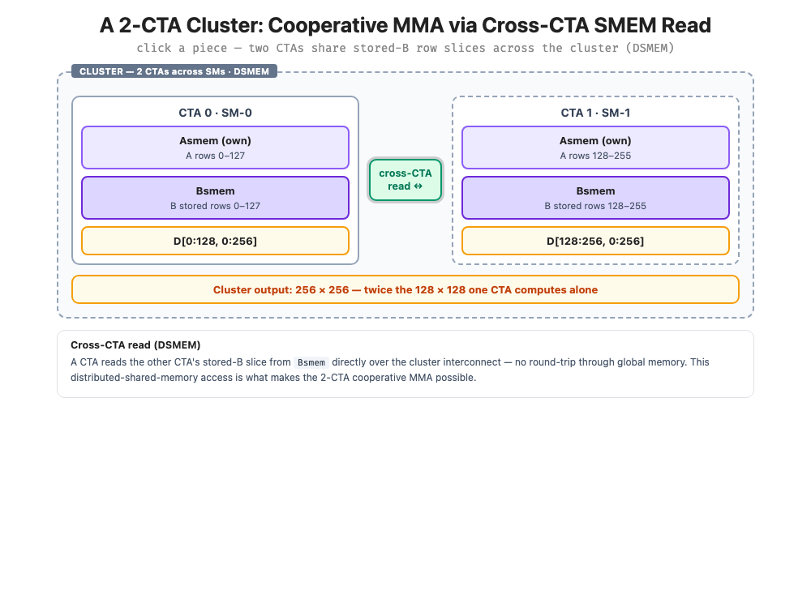

# TIRx 与高性能GEMM (下)

```{contents} 本页目录
---
depth: 2
local: true
---
```

既然已经有了 TMA 和双缓冲，为什么还说没有真正 overlap？原因是当前代码仍由一个 warpgroup 顺序推进 load、MMA 和 store。它具备了 overlap 所需的物理结构，但还没有把不同角色分给不同 warpgroup。本章的 warp specialization 会把 producer、MMA consumer、writeback 等角色拆开，让 TMA load 和 Tensor Core compute 在时间上真正重叠。

因此，这章更像是从“正确 kernel”到“可优化 kernel”的结构重建。它把数据搬运从线程指令流中解耦出来，把 SMEM 从单缓冲变成可复用 stage ring，把 CTA 从一次性 worker 变成长生命周期 worker。没有这些结构，后续再谈 warp specialization 和 cluster 只会让状态空间爆炸；有了这些结构，下一步优化才有明确落点。

## step7: warp specialization 和流水线化

TMA 已经能把 global memory 到 shared memory 的搬运从普通线程 load 中解耦出来，但这并不自动等于 load、MMA 和 store 已经重叠。如果同一组线程仍然按顺序推进“发 TMA、等 TMA、做 MMA、读 TMEM、写回”，那么 kernel 只是具备了异步能力，时间线上仍然像串行状态机。

Step 7 的关键改变，是把角色拆开：TMA producer 负责把下一批 A/B tile 搬进 SMEM，MMA consumer 负责从 SMEM 读数据并向 TMEM 累加，writeback warpgroup 负责把 TMEM 结果搬回寄存器、转换类型，再写到 D。这样一来，producer 可以准备下一轮数据，consumer 可以消耗上一轮数据，writeback 可以收尾更早完成的输出 tile。


| 同步器 | 含义 | 保护的资源 |
|-|-|-|
| tma2mma | TMA 已经把当前 stage 搬完，MMA 可以读取 SMEM | SMEM 输入 tile 的可见性 |
| mma2tma | MMA 已经消费当前 stage，TMA 可以复用这块 SMEM | SMEM stage 的生命周期 |
| mma2ld | MMA 已经完成输出累加，writeback 可以读取 TMEM | TMEM accumulator 的读时机 |
| ld2mma | writeback 已经读完 TMEM，下一轮 MMA 可以复用 TMEM | TMEM accumulator 的复用时机 |

这里的难点不是多放几个 barrier，而是每个 barrier 都对应一个资源生命周期。`PipelineState` 中的 stage 和 phase 用来描述双缓冲 ring 当前走到哪里；如果 phase 初始化错了，producer 和 consumer 可能都在等待对方先到达，最终表现为死锁。Tirx 中引入了PipelineState来专门管理stage和phase，从而避免手动管理带来的易错性。

```c++
tma_ps = PipelineState(PIPE_DEPTH, phase=1)   # Producer starts ready (phase=1)
# tma_ps.stage = current stage index
# tma_ps.phase = current phase (0 or 1)
tma_ps.advance()                          # Advance to next stage
```

writeback 阶段有一个容易忽略的同步问题：Warpgroup 0 的 128 个线程会先把各自负责的寄存器片段写入 `Dsmem`，然后由一个线程发起 TMA store。此时不能使用 `cta_sync()`，因为其他 warpgroup 正在执行 producer 或 MMA consumer 分支，它们不会到达这个同步点，使用 CTA 级同步会直接死锁。

`T.cuda.warpgroup_sync(10)` 会降到 PTX 的命名 barrier，同一个 CTA 里有编号 0 到 15 的 barrier slot。数字 10 不是 warpgroup id，而是同步槽位 id；之所以同步的是 Warpgroup 0，是因为只有 Warpgroup 0 的 128 个线程会执行到这行代码。Step 9 有两个 writeback warpgroup，所以会用 `wg_id + 10` 分配到 10 和 11，避免两个独立同步混在同一个计数器里。

完成kernel：

```python
SM_COUNT = 148  # Number of SMs on NVIDIA B200 GPU
F16_SIZE = 2

def hgemm_v7(M, N, K):
    a_type = tvm.DataType("float16")
    b_type = tvm.DataType("float16")
    d_type = tvm.DataType("float16")
    acc_type = tvm.DataType("float32")

    BLK_M, BLK_N, BLK_K = 128, 128, 64
    K_TILES = K // BLK_K
    PIPE_DEPTH = 2
    WG_NUMBER = 2

    A_layout = mma_shared_layout(a_type, SwizzleMode.SWIZZLE_128B_ATOM, (PIPE_DEPTH, BLK_M, BLK_K))
    B_layout = mma_shared_layout(b_type, SwizzleMode.SWIZZLE_128B_ATOM, (PIPE_DEPTH, BLK_N, BLK_K))
    D_layout = mma_shared_layout(d_type, SwizzleMode.SWIZZLE_128B_ATOM, (BLK_M, BLK_N))

    @T.prim_func
    def kernel(
        A: T.Buffer((M, K), a_type),
        B: T.Buffer((N, K), b_type),
        D: T.Buffer((M, N), d_type),
    ):
        T.device_entry()
        bx = T.cta_id([SM_COUNT])
        wg_id = T.warpgroup_id([WG_NUMBER])
        warp_id = T.warp_id_in_wg([4])
        lane_id = T.lane_id([32])

        # --- Allocation ---
        pool = T.SMEMPool()
        tmem_addr = pool.alloc((1,), "uint32")
        tma2mma = TMABar(pool, PIPE_DEPTH)
        mma2tma = TCGen05Bar(pool, PIPE_DEPTH)
        mma2ld  = TCGen05Bar(pool, 1)
        ld2mma  = MBarrier(pool, 1)
        pool.move_base_to(1024)
        Asmem = pool.alloc((PIPE_DEPTH, BLK_M, BLK_K), a_type, layout=A_layout)
        Bsmem = pool.alloc((PIPE_DEPTH, BLK_N, BLK_K), b_type, layout=B_layout)
        Dsmem = pool.alloc((BLK_M, BLK_N), d_type, layout=D_layout)

        # --- Barrier init ---
        tma2mma.init(1)
        mma2tma.init(1)
        mma2ld.init(1)
        ld2mma.init(128)   # all 128 Warpgroup 0 threads arrive
        pool.commit()

        # --- TMEM alloc + fence ---
        if wg_id == 0:
            if warp_id == 0:
                T.ptx.tcgen05.alloc(T.address_of(tmem_addr), n_cols=512, cta_group=1)
        T.ptx.fence.proxy_async("shared::cta")
        T.ptx.fence.mbarrier_init()
        T.cuda.cta_sync()

        tmem = T.decl_buffer(
            (128, 512), acc_type, scope="tmem", allocated_addr=tmem_addr[0],
            layout=TileLayout(S[(128, 512) : (1@TLane, 1@TCol)]))

        # --- Tile scheduler ---
        tile_scheduler = ClusterPersistentScheduler2D(
            "ts", num_m_tiles=M // BLK_M, num_n_tiles=N // BLK_N,
            l2_group_size=8, num_clusters=SM_COUNT)
        tile_scheduler.init(bx)
        m_st = T.meta_var(tile_scheduler.m_idx * BLK_M)
        n_st = T.meta_var(tile_scheduler.n_idx * BLK_N)

        # =============================================
        # Warpgroup 1: TMA Producer (warp 3) + MMA Consumer (warp 0)
        # =============================================
        if wg_id == 1:
            if warp_id == 3:
                # === TMA Producer ===
                tma_ps = PipelineState(PIPE_DEPTH, phase=1)

                @T.inline
                def tma_load(k_offset):
                    Tx.copy_async(Asmem[tma_ps.stage, :, :],
                                  A[m_st:m_st+BLK_M, k_offset:k_offset+BLK_K],
                                  dispatch="tma_auto", cta_group=1,
                                  mbar=tma2mma.ptr_to([tma_ps.stage]))
                    Tx.copy_async(Bsmem[tma_ps.stage, :, :],
                                  B[n_st:n_st+BLK_N, k_offset:k_offset+BLK_K],
                                  dispatch="tma_auto", cta_group=1,
                                  mbar=tma2mma.ptr_to([tma_ps.stage]))

                if T.filter(lane_id, T.ptx.elect_sync()):
                    while tile_scheduler.valid():
                        for k in range(K_TILES):
                            mma2tma.wait(tma_ps.stage, tma_ps.phase)
                            tma_load(k * BLK_K)
                            tma2mma.arrive(tma_ps.stage,
                                           (BLK_M * BLK_K + BLK_N * BLK_K) * F16_SIZE)
                            tma_ps.advance()
                        tile_scheduler.next_tile()

            elif warp_id == 0:
                # === MMA Consumer ===
                mma_ps = PipelineState(PIPE_DEPTH, phase=0)
                ld_ps = PipelineState(1, phase=1)

                if T.filter(lane_id, T.ptx.elect_sync()):
                    while tile_scheduler.valid():
                        # Wait for TMEM to be free from previous tile's writeback
                        ld2mma.wait(ld_ps.stage, ld_ps.phase)
                        ld_ps.advance()

                        for k in range(K_TILES):
                            tma2mma.wait(mma_ps.stage, mma_ps.phase)
                            Tx.gemm_async(
                                tmem[:, :BLK_N],
                                Asmem[mma_ps.stage, :, :],
                                Bsmem[mma_ps.stage, :, :],
                                accum=(k != 0), dispatch="tcgen05", cta_group=1)
                            mma2tma.arrive(mma_ps.stage, cta_group=1, cta_mask=0)
                            mma_ps.advance()

                        # Signal results ready for writeback
                        mma2ld.arrive(0, cta_group=1, cta_mask=0)
                        tile_scheduler.next_tile()

        # =============================================
        # Warpgroup 0: Writeback
        # =============================================
        elif wg_id == 0:
            wb_ps = PipelineState(1, phase=0)
            reg_f16 = T.alloc_local((BLK_N,), d_type)

            while tile_scheduler.valid():
                # Wait for MMA results
                mma2ld.wait(wb_ps.stage, wb_ps.phase)
                wb_ps.advance()
                T.ptx.tcgen05.fence.after_thread_sync()

                # Read TMEM -> registers (warpgroup scope)
                reg = T.alloc_local((BLK_N,), acc_type)
                reg_wg = reg.view(128, BLK_N,
                    layout=TileLayout(S[(128, BLK_N) : (1@tid_in_wg, 1)]))
                Tx.wg.copy_async(reg_wg[:], tmem[:, :BLK_N])
                T.ptx.tcgen05.wait.ld()

                # Signal TMEM free (all 128 threads arrive)
                ld2mma.arrive(0)

                # Cast fp32 -> fp16
                Tx.cast(reg_f16[:], reg[:])

                # Write to Dsmem + TMA store
                Tx.copy(Dsmem[warp_id * 32 + lane_id, :], reg_f16[:])
                T.ptx.fence.proxy_async("shared::cta")
                T.cuda.warpgroup_sync(10)
                if warp_id == 0:
                    if lane_id == 0:
                        Tx.copy_async(D[m_st:m_st+BLK_M, n_st:n_st+BLK_N],
                                      Dsmem[:, :], dispatch="tma_auto")
                        T.ptx.cp_async.bulk.commit_group()
                        T.ptx.cp_async.bulk.wait_group(0)
                T.cuda.warpgroup_sync(10)

                tile_scheduler.next_tile()

        # --- Cleanup ---
        T.cuda.cta_sync()
        if warp_id == 0:
            T.ptx.tcgen05.relinquish_alloc_permit(cta_group=1)
            T.ptx.tcgen05.dealloc(tmem_addr[0], n_cols=512, cta_group=1)

    return kernel
```

## Step 8：两个 CTA 组成 cluster，扩大片上复用半径

Step 8 把合作范围从一个 CTA 扩展到两个 CTA。每个 CTA 仍然加载自己负责的 A/B slice，但 MMA 不再只消费本 CTA 的数据，而是通过 cluster 机制读取 peer CTA 的 shared memory，合作计算一个更大的输出 tile。直观上，输入搬运量约扩大 2 倍，但输出 tile 从 `128x128` 扩到 `256x256`，元素数量扩大 4 倍；同一批 staged operands 被用于更多乘加，片上数据复用率提高。



这也是 `cta_group=2` 的意义：它不是“第 2 个 CTA”的编号，而是告诉 tcgen05/TMA/barrier 这次操作处在双 CTA 协作模式下。配套的 `cta_mask=3` 表示二进制 `11`，也就是两个 CTA 都要收到对应的 barrier 到达通知。为了让跨 CTA 的交接更可控，代码会使用 `remote_view(0)` 把关键到达汇报到 CTA 0 的 barrier 上；例如 `ld2mma.init(128 * CTA_GROUP)` 在 `CTA_GROUP=2` 时等待 256 个 writeback 线程到达，确认两个 CTA 都不再使用同一块 TMEM 后，下一轮 MMA 才能复用。

调度器也要跟着从“每个 SM 一个 persistent worker”变成“每个 cluster 一个 persistent worker”。因此 Step 8 中 `num_clusters` 通常写成 `SM_COUNT // CTA_GROUP`：一个 cluster 占用两个 CTA 的协作资源，逻辑 worker 数自然按 cluster 数而不是 CTA 数来计算。

完整的kernel实现：

```python
def hgemm_v8(M, N, K):
    a_type = tvm.DataType("float16")
    b_type = tvm.DataType("float16")
    d_type = tvm.DataType("float16")
    acc_type = tvm.DataType("float32")

    CTA_GROUP = 2
    BLK_M, BLK_N, BLK_K = 128, 128, 64
    MMA_M, MMA_N = 256, 256
    K_TILES = K // BLK_K
    PIPE_DEPTH = 4
    WG_NUMBER = 2
    F16_SIZE = 2  # fp16

    A_layout = mma_shared_layout(a_type, SwizzleMode.SWIZZLE_128B_ATOM, (PIPE_DEPTH, BLK_M, BLK_K))
    B_layout = mma_shared_layout(b_type, SwizzleMode.SWIZZLE_128B_ATOM, (PIPE_DEPTH, BLK_N, BLK_K))
    D_layout = mma_shared_layout(d_type, SwizzleMode.SWIZZLE_128B_ATOM, (BLK_M, 128))

    @T.prim_func
    def kernel(
        A: T.Buffer((M, K), a_type),
        B: T.Buffer((N, K), b_type),
        D: T.Buffer((M, N), d_type),
    ):
        T.device_entry()
        bx = T.cta_id([SM_COUNT])
        cbx, cby = T.cta_id_in_cluster([CTA_GROUP, 1])
        wg_id = T.warpgroup_id([WG_NUMBER])
        warp_id = T.warp_id_in_wg([4])
        lane_id = T.lane_id([32])

        # --- Allocation ---
        pool = T.SMEMPool()
        tmem_addr = pool.alloc((1,), "uint32")
        tma2mma = TMABar(pool, PIPE_DEPTH)
        mma2tma = TCGen05Bar(pool, PIPE_DEPTH)
        mma2ld  = TCGen05Bar(pool, 1)
        ld2mma  = MBarrier(pool, 1)
        pool.move_base_to(1024)
        Asmem = pool.alloc((PIPE_DEPTH, BLK_M, BLK_K), a_type, layout=A_layout)
        Bsmem = pool.alloc((PIPE_DEPTH, BLK_N, BLK_K), b_type, layout=B_layout)
        Dsmem = pool.alloc((BLK_M, 128), d_type, layout=D_layout)

        # --- Barrier init ---
        tma2mma.init(1)
        mma2tma.init(1)
        mma2ld.init(1)
        ld2mma.init(128 * CTA_GROUP)  # both CTAs' writeback threads
        pool.commit()

        # --- TMEM alloc (cooperative) ---
        if wg_id == 0:
            if warp_id == 0:
                T.ptx.tcgen05.alloc(T.address_of(tmem_addr), n_cols=512, cta_group=CTA_GROUP)
        T.ptx.fence.proxy_async("shared::cta")
        T.ptx.fence.mbarrier_init()
        T.cuda.cta_sync()

        tmem = T.decl_buffer(
            (128, 512), acc_type, scope="tmem", allocated_addr=tmem_addr[0],
            layout=TileLayout(S[(128, 512) : (1@TLane, 1@TCol)]))

        # --- Tile scheduler (cluster tiles) ---
        tile_scheduler = ClusterPersistentScheduler2D(
            "ts", num_m_tiles=M // 256, num_n_tiles=N // 256,
            l2_group_size=8, num_clusters=SM_COUNT // CTA_GROUP)
        tile_scheduler.init(bx // CTA_GROUP)
        m_idx = T.meta_var(tile_scheduler.m_idx)
        n_idx = T.meta_var(tile_scheduler.n_idx)
        m_st = T.meta_var((m_idx * CTA_GROUP + cbx) * BLK_M)
        n_st = T.meta_var((n_idx * CTA_GROUP + cbx) * BLK_N)

        # --- Cross-CTA barrier view ---
        tma2mma_cta0 = tma2mma.remote_view(0)
        ld2mma_cta0 = ld2mma.remote_view(0)

        # =============================================
        # Warpgroup 1: TMA Producer (warp 3) + MMA Consumer (warp 0)
        # =============================================
        if wg_id == 1:
            if warp_id == 3:
                tma_ps = PipelineState(PIPE_DEPTH, phase=1)

                @T.inline
                def tma_load(k_offset):
                    Tx.copy_async(Asmem[tma_ps.stage, :, :],
                                  A[m_st:m_st+BLK_M, k_offset:k_offset+BLK_K],
                                  dispatch="tma_auto", cta_group=CTA_GROUP,
                                  mbar=tma2mma_cta0.ptr_to([tma_ps.stage]))
                    Tx.copy_async(Bsmem[tma_ps.stage, :, :],
                                  B[n_st:n_st+BLK_N, k_offset:k_offset+BLK_K],
                                  dispatch="tma_auto", cta_group=CTA_GROUP,
                                  mbar=tma2mma_cta0.ptr_to([tma_ps.stage]))

                if T.filter(lane_id, T.ptx.elect_sync()):
                    while tile_scheduler.valid():
                        for k in range(K_TILES):
                            mma2tma.wait(tma_ps.stage, tma_ps.phase)
                            tma_load(k * BLK_K)
                            if cbx == 0:
                                tma2mma_cta0.arrive(tma_ps.stage,
                                    CTA_GROUP * (BLK_M * BLK_K + BLK_N * BLK_K) * F16_SIZE)
                            tma_ps.advance()
                        tile_scheduler.next_tile()

            elif warp_id == 0:
                mma_ps = PipelineState(PIPE_DEPTH, phase=0)
                ld_ps = PipelineState(1, phase=1)

                if cbx == 0:
                    if T.filter(lane_id, T.ptx.elect_sync()):
                        while tile_scheduler.valid():
                            ld2mma.wait(ld_ps.stage, ld_ps.phase)
                            ld_ps.advance()

                            for k in range(K_TILES):
                                tma2mma.wait(mma_ps.stage, mma_ps.phase)
                                Tx.gemm_async(
                                    tmem[:, :MMA_N],
                                    Asmem[mma_ps.stage, :, :],
                                    Bsmem[mma_ps.stage, :, :],
                                    accum=(k != 0), dispatch="tcgen05", cta_group=CTA_GROUP)
                                mma2tma.arrive(mma_ps.stage, cta_group=CTA_GROUP, cta_mask=3)
                                mma_ps.advance()

                            mma2ld.arrive(0, cta_group=CTA_GROUP, cta_mask=3)
                            tile_scheduler.next_tile()

        # =============================================
        # Warpgroup 0: Writeback (256 columns in 2 x 128-column chunks)
        # =============================================
        elif wg_id == 0:
            wb_ps = PipelineState(1, phase=0)
            reg_f16 = T.alloc_local((128,), d_type)

            while tile_scheduler.valid():
                mma2ld.wait(wb_ps.stage, wb_ps.phase)
                wb_ps.advance()
                T.ptx.tcgen05.fence.after_thread_sync()

                for no in T.unroll(2):  # 2 chunks of 128 columns = 256 total
                    reg = T.alloc_local((128,), acc_type)
                    reg_wg = reg.view(128, 128,
                        layout=TileLayout(S[(128, 128) : (1@tid_in_wg, 1)]))
                    Tx.wg.copy_async(reg_wg[:], tmem[:, no * 128:(no + 1) * 128])
                    T.ptx.tcgen05.wait.ld()
                    Tx.cast(reg_f16[:], reg[:])
                    Tx.copy(Dsmem[warp_id * 32 + lane_id, :], reg_f16[:])
                    T.ptx.fence.proxy_async("shared::cta")
                    T.cuda.warpgroup_sync(10)
                    if warp_id == 0:
                        if lane_id == 0:
                            n_st_epi = T.meta_var(n_idx * 256 + no * 128)
                            Tx.copy_async(D[m_st:m_st+BLK_M, n_st_epi:n_st_epi+128],
                                          Dsmem[:, :], dispatch="tma_auto")
                            T.ptx.cp_async.bulk.commit_group()
                            T.ptx.cp_async.bulk.wait_group(0)
                    T.cuda.warpgroup_sync(10)

                ld2mma_cta0.arrive(0)
                tile_scheduler.next_tile()

        # --- Cleanup ---
        T.cuda.cluster_sync()
        if warp_id == 0:
            T.ptx.tcgen05.relinquish_alloc_permit(cta_group=CTA_GROUP)
            T.ptx.tcgen05.dealloc(tmem_addr[0], n_cols=512, cta_group=CTA_GROUP)

    return kernel
```


## Step 9：增加第二个 MMA consumer，让 B tile 被更多次使用

Step 9 保留 Step 8 的双 CTA cluster，但在 cluster 内增加第二个 MMA consumer。两个 consumer 处理不同的 M 行块，却共享相同的 B tile；cluster 的有效输出从 `256x256` 进一步扩到 `512x256`。这一步选择复用 B 而不是 A，是因为两个 consumer 都在计算同一批 N 列上的输出，只是 M 行不同，所以 B 是天然公共输入，而 A 必须随 M 行块变化。

这一步带来的代码复杂度主要体现在资源隔离。两个 consumer 需要不同的 A 起点、不同的 TMEM accumulator 范围，以及不同的 writeback 同步槽位；但它们可以共用同一个 staged B tile。换句话说，Step 9 不是简单地“多开一个算子”，而是在保证 barrier 和 TMEM 生命周期不混淆的前提下，让昂贵的 B 搬运服务更多 MMA。

完整kernel实现参考：

```python
def hgemm_v9(M, N, K):
    a_type = tvm.DataType("float16")
    b_type = tvm.DataType("float16")
    d_type = tvm.DataType("float16")
    acc_type = tvm.DataType("float32")

    CTA_GROUP = 2
    NUM_CONSUMER = 2
    BLK_M, BLK_N, BLK_K = 128, 128, 64
    MMA_N = BLK_N * CTA_GROUP   # 256
    K_TILES = K // BLK_K
    PIPE_DEPTH = 4
    EPI_N = 64
    WG_NUMBER = 3
    F16_SIZE = 2  # fp16

    A_layout = mma_shared_layout(a_type, SwizzleMode.SWIZZLE_128B_ATOM,
                                 (PIPE_DEPTH, NUM_CONSUMER, BLK_M, BLK_K))
    B_layout = mma_shared_layout(b_type, SwizzleMode.SWIZZLE_128B_ATOM,
                                 (PIPE_DEPTH, BLK_N, BLK_K))
    D_layout = mma_shared_layout(d_type, SwizzleMode.SWIZZLE_128B_ATOM,
                                 (NUM_CONSUMER, BLK_M, EPI_N))

    @T.prim_func
    def kernel(
        A: T.Buffer((M, K), a_type),
        B: T.Buffer((N, K), b_type),
        D: T.Buffer((M, N), d_type),
    ):
        T.device_entry()
        bx = T.cta_id([SM_COUNT])
        cbx, cby = T.cta_id_in_cluster([CTA_GROUP, 1])
        wg_id = T.warpgroup_id([WG_NUMBER])
        warp_id = T.warp_id_in_wg([4])
        lane_id = T.lane_id([32])

        # --- Allocation ---
        pool = T.SMEMPool()
        tmem_addr = pool.alloc((1,), "uint32")
        tma2mma = TMABar(pool, PIPE_DEPTH)
        mma2tma = TCGen05Bar(pool, PIPE_DEPTH)
        mma2ld  = TCGen05Bar(pool, NUM_CONSUMER)   # depth=2, one slot per consumer
        ld2mma  = MBarrier(pool, NUM_CONSUMER)     # depth=2, one slot per consumer
        pool.move_base_to(1024)
        Asmem = pool.alloc((PIPE_DEPTH, NUM_CONSUMER, BLK_M, BLK_K), a_type, layout=A_layout)
        Bsmem = pool.alloc((PIPE_DEPTH, BLK_N, BLK_K), b_type, layout=B_layout)
        Dsmem = pool.alloc((NUM_CONSUMER, BLK_M, EPI_N), d_type, layout=D_layout)

        # --- Barrier init ---
        tma2mma.init(1)
        mma2tma.init(NUM_CONSUMER)  # each stage expects 2 arrivals
        mma2ld.init(1)              # each slot gets 1 arrival
        ld2mma.init(128 * CTA_GROUP)  # both CTAs' writeback threads
        pool.commit()

        # --- TMEM alloc (cooperative) ---
        if wg_id == 0:
            if warp_id == 0:
                T.ptx.tcgen05.alloc(T.address_of(tmem_addr), n_cols=512, cta_group=CTA_GROUP)
        T.ptx.fence.proxy_async("shared::cta")
        T.ptx.fence.mbarrier_init()
        T.cuda.cta_sync()

        tmem = T.decl_buffer(
            (128, 512), acc_type, scope="tmem", allocated_addr=tmem_addr[0],
            layout=TileLayout(S[(128, 512) : (1@TLane, 1@TCol)]))

        # --- Tile scheduler (512x256 cluster tiles) ---
        tile_scheduler = ClusterPersistentScheduler2D(
            "ts", num_m_tiles=M // 256 // NUM_CONSUMER, num_n_tiles=N // 256,
            l2_group_size=8, num_clusters=SM_COUNT // CTA_GROUP)
        tile_scheduler.init(bx // CTA_GROUP)
        m_idx = T.meta_var(tile_scheduler.m_idx)
        n_idx = T.meta_var(tile_scheduler.n_idx)
        m_st = T.meta_var((m_idx * NUM_CONSUMER * CTA_GROUP + cbx) * BLK_M)
        n_st = T.meta_var((n_idx * CTA_GROUP + cbx) * BLK_N)

        tma2mma_cta0 = tma2mma.remote_view(0)
        ld2mma_cta0 = ld2mma.remote_view(0)

        # =============================================
        # Warpgroup 2: TMA Producer (warp 3) + 2 MMA Consumers (warp 0, 1)
        # =============================================
        if wg_id == 2:
            if warp_id == 3:
                # === TMA Producer: loads 2 A blocks + 1 B block per stage ===
                tma_ps = PipelineState(PIPE_DEPTH, phase=1)

                @T.inline
                def tma_load(k_offset):
                    m_st_c1 = T.meta_var(m_st + CTA_GROUP * BLK_M)
                    Tx.copy_async(Asmem[tma_ps.stage, 0, :, :],
                                  A[m_st:m_st+BLK_M, k_offset:k_offset+BLK_K],
                                  dispatch="tma_auto", cta_group=CTA_GROUP,
                                  mbar=tma2mma_cta0.ptr_to([tma_ps.stage]))
                    Tx.copy_async(Asmem[tma_ps.stage, 1, :, :],
                                  A[m_st_c1:m_st_c1+BLK_M, k_offset:k_offset+BLK_K],
                                  dispatch="tma_auto", cta_group=CTA_GROUP,
                                  mbar=tma2mma_cta0.ptr_to([tma_ps.stage]))
                    Tx.copy_async(Bsmem[tma_ps.stage, :, :],
                                  B[n_st:n_st+BLK_N, k_offset:k_offset+BLK_K],
                                  dispatch="tma_auto", cta_group=CTA_GROUP,
                                  mbar=tma2mma_cta0.ptr_to([tma_ps.stage]))

                if T.filter(lane_id, T.ptx.elect_sync()):
                    while tile_scheduler.valid():
                        for k in range(K_TILES):
                            mma2tma.wait(tma_ps.stage, tma_ps.phase)
                            tma_load(k * BLK_K)
                            if cbx == 0:
                                tma2mma_cta0.arrive(tma_ps.stage,
                                    CTA_GROUP * (NUM_CONSUMER * BLK_M * BLK_K + BLK_N * BLK_K) * F16_SIZE)
                            tma_ps.advance()
                        tile_scheduler.next_tile()

            elif warp_id < NUM_CONSUMER:
                # === MMA Consumer: warp_id selects A block and TMEM range ===
                mma_ps = PipelineState(PIPE_DEPTH, phase=0)
                ld_ps = PipelineState(1, phase=1)

                if cbx == 0:
                    if T.filter(lane_id, T.ptx.elect_sync()):
                        while tile_scheduler.valid():
                            ld2mma.wait(warp_id, ld_ps.phase)
                            ld_ps.advance()

                            for k in range(K_TILES):
                                tma2mma.wait(mma_ps.stage, mma_ps.phase)
                                Tx.gemm_async(
                                    tmem[:, warp_id * MMA_N:warp_id * MMA_N + MMA_N],
                                    Asmem[mma_ps.stage, warp_id, :, :],
                                    Bsmem[mma_ps.stage, :, :],
                                    accum=(k != 0), dispatch="tcgen05", cta_group=CTA_GROUP)
                                mma2tma.arrive(mma_ps.stage, cta_group=CTA_GROUP, cta_mask=3)
                                mma_ps.advance()

                            mma2ld.arrive(warp_id, cta_group=CTA_GROUP, cta_mask=3)
                            tile_scheduler.next_tile()

        # =============================================
        # Warpgroup 0/1: Writeback (each reads its consumer's TMEM range)
        # =============================================
        elif wg_id < NUM_CONSUMER:
            wb_ps = PipelineState(1, phase=0)
            reg_f16 = T.alloc_local((EPI_N,), d_type)

            while tile_scheduler.valid():
                mma2ld.wait(wg_id, wb_ps.phase)  # wait for THIS consumer
                wb_ps.advance()
                T.ptx.tcgen05.fence.after_thread_sync()

                # Read TMEM in EPI_N=64 column chunks (4 iterations for 256 cols)
                for i in T.unroll(MMA_N // EPI_N):
                    reg = T.alloc_local((EPI_N,), acc_type)
                    reg_wg = reg.view(128, EPI_N,
                        layout=TileLayout(S[(128, EPI_N) : (1@tid_in_wg, 1)]))
                    col_st = T.meta_var(wg_id * MMA_N + i * EPI_N)
                    col_end = T.meta_var(wg_id * MMA_N + i * EPI_N + EPI_N)
                    Tx.wg.copy_async(reg_wg[:], tmem[:, col_st:col_end])
                    T.ptx.tcgen05.wait.ld()
                    Tx.cast(reg_f16[:], reg[:])
                    Tx.copy(Dsmem[wg_id, warp_id * 32 + lane_id, :], reg_f16[:])
                    T.ptx.fence.proxy_async("shared::cta")
                    T.cuda.warpgroup_sync(wg_id + 10)
                    if warp_id == 0:
                        if lane_id == 0:
                            m_st_epi = T.meta_var(
                                (m_idx * NUM_CONSUMER * CTA_GROUP + wg_id * CTA_GROUP + cbx) * BLK_M)
                            n_st_epi = T.meta_var(n_idx * MMA_N + i * EPI_N)
                            Tx.copy_async(
                                D[m_st_epi:m_st_epi+BLK_M, n_st_epi:n_st_epi+EPI_N],
                                Dsmem[wg_id, :, :], dispatch="tma_auto")
                            T.ptx.cp_async.bulk.commit_group()
                            T.ptx.cp_async.bulk.wait_group(0)
                    T.cuda.warpgroup_sync(wg_id + 10)

                ld2mma_cta0.arrive(wg_id)
                tile_scheduler.next_tile()

        # --- Cleanup ---
        T.cuda.cluster_sync()
        if warp_id == 0:
            T.ptx.tcgen05.relinquish_alloc_permit(cta_group=CTA_GROUP)
            T.ptx.tcgen05.dealloc(tmem_addr[0], n_cols=512, cta_group=CTA_GROUP)

    return kernel
```

## 性能对比

在 NVIDIA B200 上测试 `M=N=K=4096`、fp16 输入、锁频、每个版本 1,000 次计时。结果显示，最终 Step 9 与 cuBLAS reference 达到同样的 0.094 ms。

| 版本 | 关键机制 | 耗时 | 相对 Step 1 |
|-|-|-|-|
| Step 1 | 同步 load 加 MMA | 70 ms | 1x |
| Step 3 | 空间 tiling 覆盖完整矩阵 | 53.6 ms | 约 1.3x |
| Step 4 | TMA 异步搬运 | 0.49 ms | 约 142x |
| Step 7 | persistent scheduler 加 warp specialization | 0.23 ms | 约 309x |
| Step 8 | two-CTA cluster cooperative MMA | 0.104 ms | 约 676x |
| Step 9 | multi-consumer 复用 B tile | 0.094 ms | 约 744x |
| cuBLAS | 参考实现 | 0.094 ms | 约 744x |


## 总结

从局部增益看，Step 4 到 Step 7 主要靠软件流水、persistent scheduling 和 warp specialization，把 TMA 搬运、Tensor Core 计算、writeback 真正错开；Step 7 到 Step 8 靠 cluster 扩大 A/B operand 的复用半径；Step 8 到 Step 9 则靠第二个 consumer 进一步摊薄 B tile 的搬运成本。最终性能接近 cuBLAS，不是因为某一条指令神奇地快，而是因为数据移动、执行重叠和片上复用三件事同时对齐了。

Tirx 的实现分析主要看三点：

第一，看 Scope：每个分支到底由哪个 warp、哪个 warpgroup、哪个 CTA 或哪个 cluster 执行。很多同步语句的含义都取决于“谁会到达这里”，例如 `warpgroup_sync(10)` 只对实际执行到该分支的 128 个线程成立。

第二，看 Layout：SMEM stage、TMEM accumulator、每线程寄存器视图并不是普通数组，它们描述的是硬件资源如何被线程集合共同解释。理解 layout，才能解释为什么每个线程只持有一小段寄存器，却能 collectively 表示完整 tile。

第三，看 Dispatch：`Tx.copy`、`Tx.gemm_async`、barrier arrive/wait 这些 TIRx 写法背后分别对应 TMA、tcgen05 和 mbarrier/命名 barrier。高级 GEMM kernel 的核心不是把这些 API 串起来，而是让每条硬件路径在正确的 scope 和生命周期里运行。

因此，这一章真正展示的是 Blackwell GEMM 优化的系统性：TMA 解决供数方式，warp specialization 解决时间重叠，cluster 解决跨 CTA 复用，multi-consumer 解决同一 operand 的更高复用密度。把这些层次连起来看，才能理解一个 kernel 如何一步步逼近工业级 GEMM 实现。
