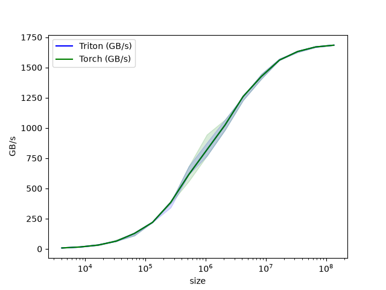
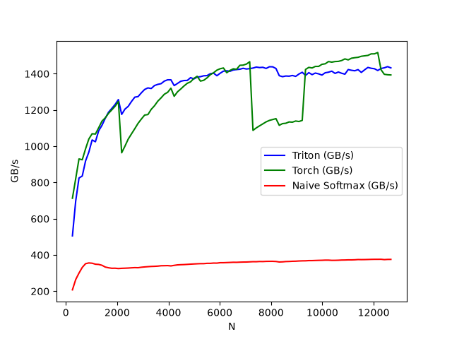
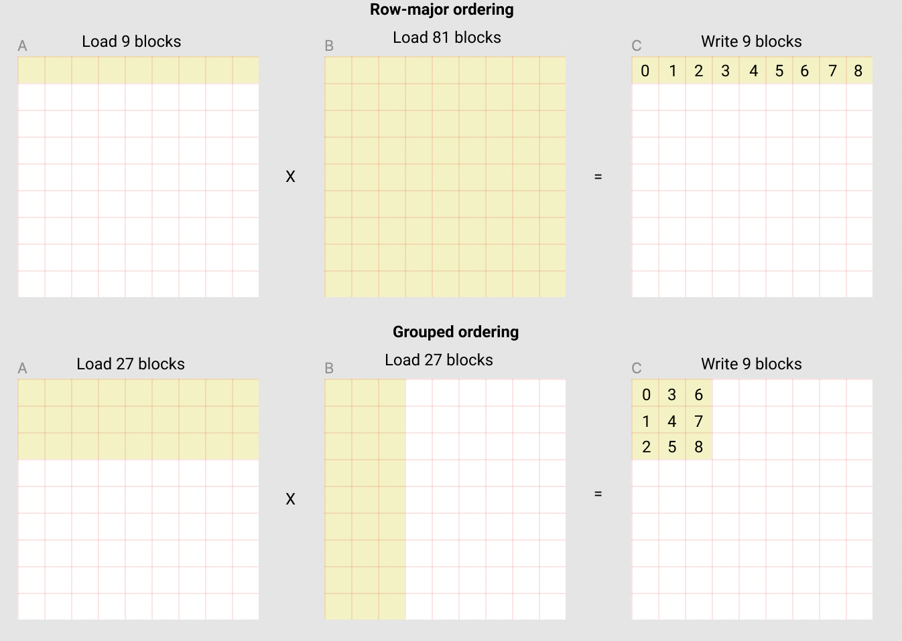
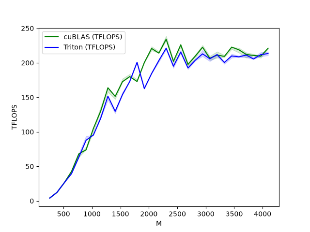
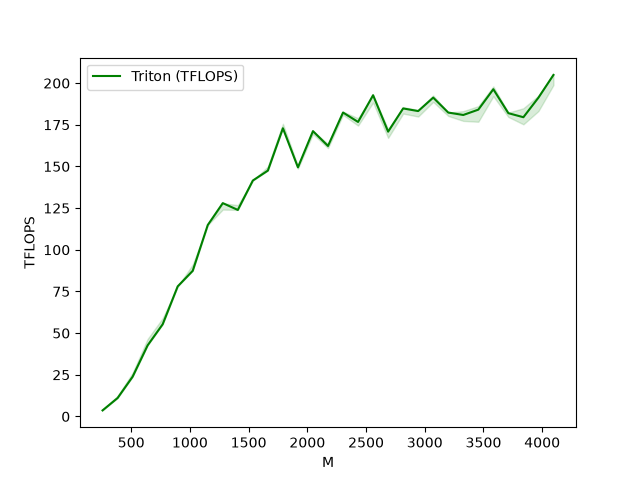

# Triton 高性能编程

```{contents} 本页目录
---
depth: 2
local: true
---
```

## Vector Add：从一个向量加法 kernel 看懂编程模型

Triton 的入门示例可以从向量加法开始：给定两个长度相同的一维张量 `x` 和 `y`，计算 `z = x + y`。这个计算本身不复杂，但它正好暴露 Triton 编程模型的几个核心问题：kernel 如何定义，program 如何映射到数据块，为什么需要 mask，元参数如何在 JIT 编译期参与 shape 推导，以及如何用 benchmark 判断自定义算子的真实吞吐。


向量加法的数学形式是：

$$z_i=x_i+y_i,\quad 0\le i<n$$

每个元素只做一次加法，计算量很低，主要成本来自内存访问。对 `float32` 输入来说，每个元素需要读 `x_i` 4 字节、读 `y_i` 4 字节、写 `z_i` 4 字节，所以理论带宽统计常按每元素 12 字节估算：

$$GB/s=\frac{3\times n\times sizeof(float32)}{time}$$

瓶颈基本是从 DRAM 到 kernel 再写回 DRAM 的路径是否高效。

### Compute Kernel：一个 program 处理一个连续 block

Triton kernel 用 `@triton.jit` 修饰。被 JIT 编译的函数参数可以分成两类：运行时参数，例如输入输出指针和元素个数；编译期元参数，例如 `BLOCK_SIZE: tl.constexpr`。后者必须在编译期可见，因为它会决定 `tl.arange(0, BLOCK_SIZE)` 的向量长度，也影响生成代码的形状。

```python
import torch
import triton
import triton.language as tl

DEVICE = triton.runtime.driver.active.get_active_torch_device()


@triton.jit
def add_kernel(x_ptr,
               y_ptr,
               output_ptr,
               n_elements,
               BLOCK_SIZE: tl.constexpr):
    pid = tl.program_id(axis=0)
    block_start = pid * BLOCK_SIZE
    offsets = block_start + tl.arange(0, BLOCK_SIZE)
    mask = offsets < n_elements

    x = tl.load(x_ptr + offsets, mask=mask)
    y = tl.load(y_ptr + offsets, mask=mask)
    output = x + y
    tl.store(output_ptr + offsets, output, mask=mask)
```

代码里最关键的是 `pid` 和 `offsets`。`tl.program_id(axis=0)` 取出当前 program 在 1D grid 中的编号。假设 `BLOCK_SIZE = 1024`，那么 `pid = 0` 处理 `[0, 1024)`，`pid = 1` 处理 `[1024, 2048)`。`tl.arange(0, BLOCK_SIZE)` 不是 Python list，而是 Triton IR 中的一组向量 lane，后续 `tl.load` 和 `tl.store` 会按这些 offsets 发起向量化内存访问。

| 概念 | 在代码中的位置 | 含义 |
|-|-|-|
| Program | `tl.program_id(axis=0)` | 一个 SPMD kernel 实例，负责一个 block 的元素。 |
| Block | `BLOCK_SIZE` | 每个 program 处理的元素数量，是编译期元参数。 |
| Offsets | `block_start + tl.arange(...)` | 当前 program 覆盖的全局元素下标。 |
| Mask | `offsets < n_elements` | 保护最后一个不满 block 的尾部访问。 |

### 为什么 mask 是必需的

如果 `n_elements` 正好能被 `BLOCK_SIZE` 整除，最后一个 program 的 offsets 都合法。但真实输入长度通常不是 block size 的整数倍。比如测试长度是 `98432`，而 launch 时 `BLOCK_SIZE = 1024`。需要的 program 数是：

$$\lceil 98432 / 1024 \rceil = 97$$

前 96 个 program 覆盖 `0` 到 `98303`，第 97 个 program 的 offsets 覆盖 `98304` 到 `99327`。其中 `98432` 之后的下标已经越界，如果没有 mask，load/store 会访问非法地址。`mask = offsets < n_elements` 让 Triton 只对合法 lane 执行内存操作，不合法 lane 被屏蔽掉。

这也是 Triton 和普通 Python 向量表达的差别之一。Triton 让 kernel 作者显式处理 block 边界，换来的是对内存访问形状和编译期展开的控制。对于更复杂的矩阵乘、softmax 或 layer norm，mask 同样会出现在 tile 边界、causal mask、padding 或 ragged batch 中。

### Launch Wrapper：Python 张量如何进入 GPU kernel

kernel 本身只描述单个 program 要做什么；还需要一个 Python wrapper 负责分配输出、计算 grid，并用 Triton 的 launch 语法提交 GPU kernel。

```python
def add(x: torch.Tensor, y: torch.Tensor):
    output = torch.empty_like(x)
    assert x.device == DEVICE and y.device == DEVICE and output.device == DEVICE
    n_elements = output.numel()

    grid = lambda meta: (triton.cdiv(n_elements, meta['BLOCK_SIZE']), )
    add_kernel[grid](x, y, output, n_elements, BLOCK_SIZE=1024)
    return output
```

`grid` 是一个根据 meta-parameters 计算 launch shape 的函数。这里使用 `triton.cdiv` 做向上取整，确保最后一个 partial block 也有 program 负责。调用 `add_kernel[grid](...)` 时，Triton 会把 `torch.Tensor` 隐式转换为指向首元素的 device pointer，并把 `BLOCK_SIZE=1024` 作为编译期元参数传入。

返回 `output` 时，kernel 可能仍在 GPU 上异步执行。这个行为和 CUDA kernel launch 一致：Python 调用把工作提交到设备队列，不会默认阻塞等待完成。只有后续需要同步结果、计时或跨设备依赖时，才需要显式同步。Triton 的 benchmark 工具内部会处理计时所需的同步。

### Scope / Layout / Dispatch：用三个问题读这段代码

把这个最小例子放进 Scope / Layout / Dispatch 框架，会比只记 API 更稳。

| 问题 | 向量加法中的答案 | 为什么重要 |
|-|-|-|
| Scope | 一个 Triton program 处理 `BLOCK_SIZE` 个连续元素。 | 决定 launch grid 大小，也决定每个 program 的工作量。 |
| Layout | `offsets = pid * BLOCK_SIZE + arange`，形成连续一维访问。 | 连续访问有利于合并访存；更复杂 kernel 会把 layout 扩展到二维 tile。 |
| Dispatch | `@triton.jit` 把 Python DSL 编译成 GPU kernel，`tl.load/store` 变成设备内存访问。 | 决定 Python 表达式是否只是在描述 IR，而不是立即在 CPU 上执行。 |

这个例子没有 shared memory、Tensor Core 或 warp specialization，但它已经包含 Triton 的基本抽象边界。到了矩阵乘法，`tl.arange` 会从一维 offsets 扩展成二维 tile 坐标；到了 fused softmax，mask 不只保护尾部，还保护每行长度；到了 attention，program id 可能同时编码 batch、head 和 block 坐标。

### Benchmark

向量加法是典型 memory-bound 操作。单个元素只做一次加法，算术开销很小；性能更接近“每秒能搬多少字节”。因此 tutorial 用 `triton.testing.perf_report` 扫描不同输入长度，从 $2^{12}$ 到 $2^{27}$，分别测 Triton 和 Torch 的吞吐。

```python
@triton.testing.perf_report(
    triton.testing.Benchmark(
        x_names=['size'],
        x_vals=[2**i for i in range(12, 28, 1)],
        x_log=True,
        line_arg='provider',
        line_vals=['triton', 'torch'],
        line_names=['Triton', 'Torch'],
        styles=[('blue', '-'), ('green', '-')],
        ylabel='GB/s',
        plot_name='vector-add-performance',
        args={},
    ))
def benchmark(size, provider):
    x = torch.rand(size, device=DEVICE, dtype=torch.float32)
    y = torch.rand(size, device=DEVICE, dtype=torch.float32)
    quantiles = [0.5, 0.2, 0.8]
    if provider == 'torch':
        ms, min_ms, max_ms = triton.testing.do_bench(lambda: x + y, quantiles=quantiles)
    if provider == 'triton':
        ms, min_ms, max_ms = triton.testing.do_bench(lambda: add(x, y), quantiles=quantiles)
    gbps = lambda ms: 3 * x.numel() * x.element_size() * 1e-9 / (ms * 1e-3)
    return gbps(ms), gbps(max_ms), gbps(min_ms)
```

这里的 `quantiles = [0.5, 0.2, 0.8]` 表示返回中位数、较快分位和较慢分位，用来画出吞吐曲线的不确定范围。示例输出中，从 `4096` 到 `134217728` 个元素，吞吐从 `8 GB/s` 上升到约 `1684 GB/s`。这个趋势比单个耗时更有解释力：小输入主要受 launch overhead 影响，大输入逐渐接近设备内存带宽上限。

下图来自 tutorial 运行结果，展示了不同 size 下 Triton 与 Torch 的向量加法吞吐对比。



### 小结

向量加法看起来简单，但它提供了后续 Triton kernel 的基本骨架。任何 tile kernel 都需要回答：当前 program id 对应哪块输出，如何从 program id 推导 input/output offsets，哪些 lane 是合法的，哪些参数必须是 `tl.constexpr`，以及如何建立 reference 和 benchmark。

把向量加法推广到二维矩阵时，`tl.program_id(axis=0)` 和 `tl.program_id(axis=1)` 可以分别表示 row block 和 column block；`tl.arange` 可以构造 row offsets 与 column offsets 的组合；mask 从一维边界扩展成二维边界。再往后到 matmul，program 会负责一个 $M\times N$ 输出 tile，并沿 $K$ 维循环加载 A/B tile。

因此，这个入门示例真正要掌握的是执行模型，而不是向量加法本身。只要能稳定解释 `pid`、`BLOCK_SIZE`、`offsets`、`mask`、`grid` 和 `@triton.jit` 的关系，就已经具备阅读更复杂 Triton tutorial 的基础。

Triton 用 Python 语法描述 GPU kernel，但它不是把普通 Python 函数搬到 GPU 上执行。`@triton.jit` 标记的是一段可编译的 kernel IR；`tl.program_id` 给出 SPMD program 的身份；`tl.arange` 构造 block 内的向量 lanes；`mask` 负责边界安全；launch grid 决定有多少 program 并行覆盖输入。

Vector Add 的价值在于把这些概念压缩到几十行代码里。读懂这段代码以后，再看 fused softmax、matmul、attention 等 tutorial，就可以沿着同一条路径继续追问：每个 program 负责哪个 tile，tile 内的 offsets 如何组织，边界和同步如何处理，benchmark 指标到底反映计算吞吐还是内存带宽。


##  Fused Softmax：看懂 Triton 的算子融合

向量加法展示了 Triton 最基本的 program / block / mask 模型，但真实模型算子通常不只是逐元素读写。Softmax 是一个更接近实际优化问题的例子：它有行内归约、数值稳定处理、指数函数、归一化除法，还很容易被中间张量写回 DRAM 拖慢。

> 核心观点：Fused Softmax 的收益来自把 `max`、减法、`exp`、`sum` 和除法放在同一个 kernel 内完成。每行输入只从 DRAM 读一次，归约和临时值尽量留在片上，最后只把 softmax 结果写回一次。

### Softmax 的数学式与内存流量

对一行向量 $x\in\mathbb{R}^{N}$，数值稳定的 softmax 通常先减去行最大值：

$$m=\max_{0\le j<N} x_j$$

$$y_i=\frac{e^{x_i-m}}{\sum_{j=0}^{N-1} e^{x_j-m}}$$

减去 $m$ 不会改变 softmax 结果，因为分子和分母同时乘上了同一个常数因子；但它会避免 `exp` 输入过大导致上溢。对矩阵 $X\in\mathbb{R}^{M\times N}$，这个计算逐行独立，因此天然适合把“一行”作为一个 Triton program 的工作单元。

问题在于，朴素 PyTorch 写法会把每个阶段拆成多个张量操作。下面这个 reference 很清楚地暴露了数据流：

```python
def naive_softmax(x):
    # read  MN elements ; write M  elements
    x_max = x.max(dim=1)[0]
    # read MN + M elements ; write MN elements
    z = x - x_max[:, None]
    # read  MN elements ; write MN elements
    numerator = torch.exp(z)
    # read  MN elements ; write M  elements
    denominator = numerator.sum(dim=1)
    # read MN + M elements ; write MN elements
    ret = numerator / denominator[:, None]
    # in total: read 5MN + 2M elements ; wrote 3MN + 2M elements
    return ret
```

如果只按元素搬运次数估算，朴素路径需要从 DRAM 读取 $5MN+2M$ 个元素、写回 $3MN+2M$ 个元素，总共是 $8MN+4M$ 次元素传输。一个 fused kernel 理想情况下只需要读入 $MN$ 个输入元素、写回 $MN$ 个输出元素，总共 $2MN$ 次元素传输。因此当 $N$ 足够大时，单从内存流量看就有接近 4 倍的理论空间：

$$\frac{8MN+4M}{2MN}=4+\frac{2}{N}\approx 4$$

这不是说任何 fused softmax 都自动快 4 倍。实际性能还受 launch overhead、寄存器占用、片上存储容量、指数函数吞吐、PyTorch 内部实现和输入形状影响。但这个估算说明了优化方向：对 memory-bound 的链式张量操作，减少中间张量落回 DRAM 往往比减少几条算术指令更重要。

###  Compute Kernel：一个 program 处理若干行

Fused Softmax 的 kernel 仍然用 `@triton.jit` 修饰，但它和 Vector Add 有两个明显差异。第一，program 处理的是矩阵的一行，而不是一段一维向量；第二，program 内部要做 `tl.max` 和 `tl.sum` 这样的 reduction，而不仅是逐 lane 加法。

```python
@triton.jit
def softmax_kernel(output_ptr, input_ptr, input_row_stride, output_row_stride,
                   n_rows, n_cols, BLOCK_SIZE: tl.constexpr,
                   num_stages: tl.constexpr):
    row_start = tl.program_id(0)
    row_step = tl.num_programs(0)
    for row_idx in tl.range(row_start, n_rows, row_step,
                            num_stages=num_stages):
        row_start_ptr = input_ptr + row_idx * input_row_stride
        col_offsets = tl.arange(0, BLOCK_SIZE)
        input_ptrs = row_start_ptr + col_offsets
        mask = col_offsets < n_cols

        row = tl.load(input_ptrs, mask=mask, other=-float('inf'))
        row_minus_max = row - tl.max(row, axis=0)
        numerator = tl.exp(row_minus_max)
        denominator = tl.sum(numerator, axis=0)
        softmax_output = numerator / denominator

        output_row_start_ptr = output_ptr + row_idx * output_row_stride
        output_ptrs = output_row_start_ptr + col_offsets
        tl.store(output_ptrs, softmax_output, mask=mask)
```

`tl.program_id(0)` 给出当前 program 的起始行号，`tl.num_programs(0)` 给出本次 launch 一共有多少个 program。循环里的 `row_idx = row_start, row_start + row_step, ...` 表示一个 program 可能处理多行，这是一种 persistent program 的写法：先启动一批常驻 program，再让它们按步长持续领取后续行。

每一行内部，`col_offsets = tl.arange(0, BLOCK_SIZE)` 构造列方向的 lane。`tl.load` 把整行加载成一个向量，随后 `tl.max(row, axis=0)` 和 `tl.sum(numerator, axis=0)` 在这个向量上做 reduction。这里的 `axis=0` 不是矩阵的第 0 维，而是 Triton block 向量的归约轴；对单行 softmax 来说，它正好对应列方向。

`tl.exp` 使用的是快速近似指数函数，可以类比 CUDA 中的 `__expf`。这也是为什么正确性验证使用 `torch.allclose` 而不是逐 bit 相等：softmax 的数学结果应该对齐，但浮点近似和执行路径不同，不能要求每个 bit 完全一致。

### Power-of-two padding：为什么尾部要填负无穷

Triton 的 block 向量长度通常要求是 2 的幂。若输入列数 $N=781$，wrapper 会取：

$$BLOCK_SIZE=2^{\lceil\log_2 781\rceil}=1024$$

这意味着每行会构造 1024 个 lane，但只有前 781 个对应真实列。mask 的作用有两层：读入时避免越界，写回时避免把 padding lane 写进输出。读入时使用 `other=-float('inf')` 也很关键，因为 softmax 里先做 max 再做 exp：

$$\max(x_0,\ldots,x_{N-1},-\infty,\ldots,-\infty)=\max(x_0,\ldots,x_{N-1})$$

$$e^{-\infty}=0$$

因此 padding lane 不会改变最大值，也不会改变分母求和。这个设计让 kernel 可以用固定的 power-of-two block shape 编译，同时仍然支持任意列数的输入矩阵。

### Wrapper：从 shape 推导 launch 数量

Kernel 只描述 program 的计算逻辑，Python wrapper 负责根据输入 shape 和设备资源选择元参数，并把 kernel 提交到 GPU。这个例子里，`BLOCK_SIZE` 来自 `triton.next_power_of_2(n_cols)`，`num_warps` 先用固定启发式设为 8，`num_stages` 根据 shared memory 容量选择 4 或 2。

```python
properties = driver.active.utils.get_device_properties(DEVICE.index)
NUM_SM = properties["multiprocessor_count"]
NUM_REGS = properties["max_num_regs"]
SIZE_SMEM = properties["max_shared_mem"]
WARP_SIZE = properties["warpSize"]
target = triton.runtime.driver.active.get_current_target()
kernels = {}


def softmax(x):
    n_rows, n_cols = x.shape
    BLOCK_SIZE = triton.next_power_of_2(n_cols)
    num_warps = 8
    num_stages = 4 if SIZE_SMEM > 200000 else 2
    y = torch.empty_like(x)

    # pre-compile kernel to get register usage and compute thread occupancy.
    kernel = softmax_kernel.warmup(
        y, x, x.stride(0), y.stride(0), n_rows, n_cols,
        BLOCK_SIZE=BLOCK_SIZE, num_stages=num_stages,
        num_warps=num_warps, grid=(1, ))
    kernel._init_handles()
    n_regs = kernel.n_regs
    size_smem = kernel.metadata.shared

    if is_hip():
        NUM_GPRS = NUM_REGS * 2 if is_cdna() else NUM_REGS
        MAX_NUM_THREADS = properties["max_threads_per_sm"]
        max_num_waves = MAX_NUM_THREADS // WARP_SIZE
        occupancy = min(NUM_GPRS // WARP_SIZE // n_regs,
                        max_num_waves) // num_warps
    else:
        occupancy = NUM_REGS // (n_regs * WARP_SIZE * num_warps)
    occupancy = min(occupancy, SIZE_SMEM // size_smem)
    num_programs = min(NUM_SM * occupancy, n_rows)

    kernel[(num_programs, 1, 1)](
        y, x, x.stride(0), y.stride(0),
        n_rows, n_cols, BLOCK_SIZE, num_stages)
    return y
```

这里最容易被忽略的是 `warmup`。wrapper 先预编译 kernel，拿到 `kernel.n_regs` 和 `kernel.metadata.shared`，再估算一个 SM 上能驻留多少个 program。寄存器越多、shared memory 越大，occupancy 越低；occupancy 过低会让可并行的行数不足，无法隐藏内存和函数单元延迟。最后的 `num_programs = min(NUM_SM * occupancy, n_rows)` 把 program 数限制在“足够填满设备，但不超过总行数”的范围内。

| 决策 | 代码位置 | 作用 |
|-|-|-|
| 行内 block 大小 | `triton.next_power_of_2(n_cols)` | 把任意列数补齐到可编译的 block shape。 |
| 行分配方式 | `row_start + k * row_step` | 每个 persistent program 跨步处理多行，减少过量 launch program。 |
| 归约位置 | `tl.max` / `tl.sum` | 在片上完成行内 reduction，避免中间张量写回 DRAM。 |
| 资源约束 | `n_regs` / `size_smem` | 估算 occupancy，避免 program 数超过设备实际承载能力。 |

### Scope / Layout / Dispatch：和 Vector Add 相比发生了什么

同样用 Scope / Layout / Dispatch 看这段代码，Fused Softmax 比 Vector Add 多出了“行内归约”和“persistent row scheduling”两层含义。

| 问题 | Fused Softmax 中的答案 | 相对 Vector Add 的变化 |
|-|-|-|
| Scope | 一个 program 从某个起始行开始，按 program 总数为步长处理多行。 | 不再是一维连续 block，而是矩阵行级任务，并用 persistent 方式复用 program。 |
| Layout | `row_idx * stride + arange` 形成一行内的列 offsets。 | 布局从一维数组段扩展为二维矩阵中的一行 tile。 |
| Dispatch | wrapper 先 warmup 编译，再基于寄存器和 shared memory 推导 program 数。 | launch shape 不再只由元素数决定，还受到设备资源与 occupancy 约束。 |

这个框架也能解释为什么假设“行能放进 GPU SRAM”。如果一行太长，单个 program 的 block 向量、寄存器和片上暂存压力会迅速上升；这时必须换成多 program 分块归约或更复杂的分阶段算法。这个 tutorial 的优化成立条件，是每行可以在一个 program 的工作集里完成 max、exp、sum 和 normalize。

### Benchmark：用 GB/s 衡量融合后的内存效率

benchmark 固定 $M=4096$ 行，扫描列数 $N=256,384,\ldots,12672$，对比 `Triton`、`torch.softmax` 和朴素 `naive_softmax`。吞吐指标按“读输入一次、写输出一次”的 fused 理想路径计算：

$$GB/s=\frac{2\times M\times N\times sizeof(float32)}{time}$$

```python
@triton.testing.perf_report(
    triton.testing.Benchmark(
        x_names=['N'],
        x_vals=[128 * i for i in range(2, 100)],
        line_arg='provider',
        line_vals=['triton', 'torch', 'naive_softmax'],
        line_names=["Triton", "Torch", "Naive Softmax"],
        styles=[('blue', '-'), ('green', '-'), ('red', '-')],
        ylabel="GB/s",
        plot_name="softmax-performance",
        args={'M': 4096},
    ))
def benchmark(M, N, provider):
    x = torch.randn(M, N, device=DEVICE, dtype=torch.float32)
    if provider == 'torch':
        ms = triton.testing.do_bench(
            lambda: torch.softmax(x, axis=-1))
    if provider == 'triton':
        ms = triton.testing.do_bench(lambda: softmax(x))
    if provider == 'naive_softmax':
        ms = triton.testing.do_bench(lambda: naive_softmax(x))
    gbps = lambda ms: 2 * x.numel() * x.element_size() * 1e-9 / (ms * 1e-3)
    return gbps(ms)
```

结果曲线里，朴素 softmax 长期停在约 $0.3$ 到 $0.38$ TB/s；Triton kernel 在中大列数上接近 $1.3$ 到 $1.4$ TB/s。与 `torch.softmax` 相比，Triton 在不少区间更快，但也不是所有列数都绝对领先，这提醒我们：shape、库实现、启动开销和设备特性都会影响最终曲线。

下图来自 tutorial 运行结果，展示了不同列数下 Triton、Torch 和朴素 softmax 的吞吐对比。



### 小结

Fused Softmax 比 Vector Add 多了一层非常关键的优化思想：把一串看起来“简单”的张量操作合并为一个拥有明确数据驻留策略的 kernel。这里的性能收益不是来自 softmax 公式本身，而是来自减少 DRAM round trip、把行内 reduction 保持在片上，以及用合适的 program 数让 SM 保持忙碌。

读懂这段代码以后，再看 layer norm、dropout、attention 的 Triton 实现会容易很多。它们共享同一类问题：每个 program 应该处理哪段数据，tile 或 row 如何在片上完成归约，哪些 padding lane 必须被 mask，哪些元参数影响编译形状，launch 数量如何与资源占用匹配。

## Triton Matrix Multiplication：从 block 映射到 L2 友好的 GEMM

这篇文章以 [Triton 官方 Matrix Multiplication tutorial](https://triton-lang.org/main/getting-started/tutorials/03-matrix-multiplication.html) 为起点，目标不是复述一段 GEMM 代码，而是把一个可接近 cuBLAS / rocBLAS 性能的 FP16 矩阵乘 kernel 拆成几个可验证的工程问题：一个 Triton program 到底负责哪块输出，二维 tensor 的指针如何在 block 内展开，为什么 program 的发射顺序会影响 L2 cache 命中率，以及 autotune 为什么是这类 kernel 的必要组成部分。

> 核心判断：Triton matmul 的难点不在写出 `C = A @ B`，而在把这个公式落实成稳定的数据路径。只要 program scope、tile layout、memory pointer、K-loop mask 和 launch ordering 任一处没有说清楚，代码看起来短，性能和正确性都会变得不可解释。

### 为什么要自己写 matmul

矩阵乘是现代深度学习和高性能计算里的基础算子。线性层、attention projection、MLP、很多 convolution lowering 之后的计算，本质上都会落到 GEMM。成熟库如 cuBLAS 或 rocBLAS 已经非常快，但它们并不总是容易定制：如果希望把 activation、量化反量化、bias、layout 特化或模型结构里的特殊约束融合进 kernel，黑盒库调用就会变成限制。

Triton 的价值在这里：它让我们用接近 Python 的 DSL 描述 GPU program，同时仍然显式控制 tile shape、指针、mask、program ordering 和编译期元参数。对一个矩阵乘 $C=A B,\quad A\in\mathbb{R}^{M\times K},\quad B\in\mathbb{R}^{K\times N},\quad C\in\mathbb{R}^{M\times N}$，Triton 版本不是让一个 program 计算整个矩阵，而是让每个 program 负责一个 $BLOCK_SIZE_M\times BLOCK_SIZE_N$ 的输出 tile。

### 把 GEMM 拆成 program 级 tile

最直接的 mental model 是 blocked GEMM。外层二维空间把输出矩阵 `C` 切成 tile；每个 tile 由一个 Triton program 计算；内层沿着 `K` 维分块累加。每次迭代读取一块 `A[m:m+BLOCK_SIZE_M, k:k+BLOCK_SIZE_K]` 和一块 `B[k:k+BLOCK_SIZE_K, n:n+BLOCK_SIZE_N]`，用 `tl.dot` 做小矩阵乘，再把结果累加到 fp32 accumulator。

```python
# Do in parallel
for m in range(0, M, BLOCK_SIZE_M):
    # Do in parallel
    for n in range(0, N, BLOCK_SIZE_N):
        acc = zeros((BLOCK_SIZE_M, BLOCK_SIZE_N), dtype=float32)
        for k in range(0, K, BLOCK_SIZE_K):
            a = A[m:m + BLOCK_SIZE_M, k:k + BLOCK_SIZE_K]
            b = B[k:k + BLOCK_SIZE_K, n:n + BLOCK_SIZE_N]
            acc += dot(a, b)
        C[m:m + BLOCK_SIZE_M, n:n + BLOCK_SIZE_N] = acc
```

这个伪代码里有两个并行层级。第一个并行层级是输出 tile 之间的并行，交给不同 Triton program；第二个层级是 program 内部的向量化 load、dot 和 store，交给 Triton compiler lowering 到 GPU 指令。对读代码的人来说，先确定每个 program 的 scope，再看 pointer 和 mask，会比直接从完整 kernel 第一行读到最后一行更稳。

### Pointer Arithmetic：二维坐标如何变成一组地址

在 Triton kernel 内，program 拿到的是线性 pointer，而不是高级 tensor view。对 row-major 二维张量 `X`，元素 `X[i, j]` 的地址可以写成：

$$addr(X_{i,j}) = base(X) + i\cdot stride_i + j\cdot stride_j$$

一个 block 的地址就是把一组行 offset 和一组列 offset 做 broadcast 组合。这里 `offs_am[:, None]` 产生 `BLOCK_SIZE_M` 行，`offs_k[None, :]` 产生 `BLOCK_SIZE_K` 列，二者相加后得到 `A` 当前 tile 的二维 pointer block；`B` 同理，只是 shape 是 $BLOCK_SIZE_K\times BLOCK_SIZE_N$。

```python
offs_am = (pid_m * BLOCK_SIZE_M + tl.arange(0, BLOCK_SIZE_M)) % M
offs_bn = (pid_n * BLOCK_SIZE_N + tl.arange(0, BLOCK_SIZE_N)) % N
offs_k = tl.arange(0, BLOCK_SIZE_K)

a_ptrs = a_ptr + (offs_am[:, None] * stride_am + offs_k[None, :] * stride_ak)
b_ptrs = b_ptr + (offs_k[:, None] * stride_bk + offs_bn[None, :] * stride_bn)
```

`M` 和 `N` 方向用了取模，是为了让最后一个不满 tile 的 program 仍然能构造合法地址；真正的有效输出由后面的 store mask 控制。`K` 方向没有用取模，因为每轮 K-loop 读入的超界 lane 应该被当成 0，不应绕回矩阵开头。这个差异很关键：`M/N` 的无效输出可以不写回，`K` 的无效乘法输入必须不贡献到累加值。

### Program ID 到输出 tile 的映射

Wrapper 用一维 grid 启动 kernel，program 数量等于 M 方向 tile 数乘以 N 方向 tile 数。最朴素的映射是 row-major：`pid_m = pid // grid_n`，`pid_n = pid % grid_n`。这种映射容易理解，但对 GEMM 并不理想，因为连续 program 会很快切换到下一行输出 tile，导致 A/B operand 的 L2 复用窗口变短。

官方 tutorial 使用 grouped ordering：先把 M 方向的若干行 tile 组成一个 group，再在 group 内按 column-major 的顺序枚举输出 tile。这样做的效果是，多个相邻 program 会围绕同一批 B tile 和一小段 A tile 工作，L2 中刚加载过的 operand 更可能被后续 program 命中。

```python
pid = tl.program_id(axis=0)
num_pid_m = tl.cdiv(M, BLOCK_SIZE_M)
num_pid_n = tl.cdiv(N, BLOCK_SIZE_N)
num_pid_in_group = GROUP_SIZE_M * num_pid_n

group_id = pid // num_pid_in_group
first_pid_m = group_id * GROUP_SIZE_M
group_size_m = min(num_pid_m - first_pid_m, GROUP_SIZE_M)

pid_m = first_pid_m + ((pid % num_pid_in_group) % group_size_m)
pid_n = (pid % num_pid_in_group) // group_size_m
```

### L2 cache reuse：为什么 grouped ordering 能提速

这一点可以从 9x9 tile 的例子看得很清楚：下图上半部分是 row-major，下半部分是 grouped ordering。为了计算前 9 个输出 tile，row-major 需要加载 9 个 A block 和 81 个 B block，总共 90 个 operand block；grouped ordering 让 program 先围绕一组 M tile 扫过多个 N tile，只需要加载 27 个 A block 和 27 个 B block，总共 54 个 operand block。



这个优化并没有改变 GEMM 的数学式，也没有改变单个 tile 的 `tl.dot` 逻辑。它只改变“先算哪个 tile”。但对 GPU 来说，这已经足够重要：官方示例提到，在某些硬件架构上，这种 ordering 可以把 A100 上的 matmul 性能从约 220 TFLOPS 提升到 245 TFLOPS，超过 10%。这说明 launch ordering 不是调度细节，而是 kernel 设计的一部分。

### Kernel 主体：load、dot、accumulate、store

完成 program-id 映射和 pointer 构造后，kernel 主体反而很直接。每个 program 创建一个 fp32 accumulator，沿 K 方向循环读取 A/B tile，用 `tl.dot` 累加。K 维最后一个分块可能不完整，所以 load 时用 mask；越界 lane 用 `other=0.0` 填充，保证不影响 dot product。

```python
accumulator = tl.zeros((BLOCK_SIZE_M, BLOCK_SIZE_N), dtype=tl.float32)
for k in range(0, tl.cdiv(K, BLOCK_SIZE_K)):
    a = tl.load(a_ptrs, mask=offs_k[None, :] < K - k * BLOCK_SIZE_K, other=0.0)
    b = tl.load(b_ptrs, mask=offs_k[:, None] < K - k * BLOCK_SIZE_K, other=0.0)
    accumulator = tl.dot(a, b, accumulator)
    a_ptrs += BLOCK_SIZE_K * stride_ak
    b_ptrs += BLOCK_SIZE_K * stride_bk
```

官方实现还在 accumulator 转回 fp16 前预留了 activation fusion 的位置，例如 `leaky_relu`。这是自定义 Triton kernel 相比黑盒 GEMM 调用的直接收益：中间结果仍在 fp32 accumulator 中时就能接入后处理，避免把 `C` 写回全局内存后再启动另一个 kernel 读回来。

写回时则反过来构造 `C` 的 pointer block，并使用 `c_mask = (offs_cm[:, None] < M) & (offs_cn[None, :] < N)` 屏蔽 M/N 方向的尾部越界。到这里，一个 program 的完整数据路径就是：从全局内存按二维 stride 读 A/B tile，在 program 内累加成 fp32 tile，按需融合 activation，cast 到 fp16，再带 mask 写回 C。

### Autotune：把 tile shape 变成可搜索参数

矩阵乘性能对 tile shape 很敏感。`BLOCK_SIZE_M`、`BLOCK_SIZE_N`、`BLOCK_SIZE_K` 决定单个 program 的工作量、寄存器压力、load 粒度和 dot shape；`GROUP_SIZE_M` 决定 L2 复用窗口；`num_warps` 与 `num_stages` 影响 program 内并行度和 pipeline 深度。不同 GPU、不同矩阵形状、不同 dtype，最优组合都可能变化。

因此官方实现没有把这些值写死，而是用 `@triton.autotune` 给出一组候选 `triton.Config`，并把 `M/N/K` 作为 autotune key。只要 key 变化，Triton 就会评估候选配置，选择当前 shape 下更合适的版本。

```python
@triton.autotune(
    configs=get_autotune_config(),
    key=['M', 'N', 'K'],
)
@triton.jit
def matmul_kernel(...,
                  BLOCK_SIZE_M: tl.constexpr,
                  BLOCK_SIZE_N: tl.constexpr,
                  BLOCK_SIZE_K: tl.constexpr,
                  GROUP_SIZE_M: tl.constexpr,
                  ACTIVATION: tl.constexpr):
    ...
```

| 参数 | 控制对象 | 性能影响 |
|-|-|-|
| `BLOCK_SIZE_M/N` | 输出 tile 的空间大小 | 影响单 program 计算量、输出 store 粒度和寄存器占用。 |
| `BLOCK_SIZE_K` | 每轮 K-loop 的 contraction 长度 | 影响 A/B load 大小、dot 指令形状和循环次数。 |
| `GROUP_SIZE_M` | program ordering 的 M 方向分组 | 影响 L2 cache 中 A/B operand 的复用机会。 |
| `num_warps` | program 内 warp 数 | 影响并行度、调度开销和寄存器压力。 |
| `num_stages` | pipeline stage 数 | 影响 load/compute overlap 与 shared resource 占用。 |

### Wrapper、正确性和 FP8 特化

Python wrapper 负责把普通 `torch.Tensor` 接到 JIT kernel：检查 `A.shape[1] == B.shape[0]`，分配输出 `C`，根据 meta-parameters 计算一维 grid，然后把输入输出 pointer、shape、stride 和 `ACTIVATION` 传给 `matmul_kernel`。其中 `A` 要求 contiguous，是为了让 `stride_am/stride_ak` 与代码里的地址假设一致。

```python
grid = lambda META: (
    triton.cdiv(M, META['BLOCK_SIZE_M']) * triton.cdiv(N, META['BLOCK_SIZE_N']),
)
matmul_kernel[grid](a, b, c, M, N, K,
                    a.stride(0), a.stride(1),
                    b.stride(0), b.stride(1),
                    c.stride(0), c.stride(1),
                    ACTIVATION=activation)
```

正确性验证用 `torch.matmul` 作为 reference。FP16 输入下，官方示例使用 `torch.allclose(..., atol=1e-2, rtol=0)`；FP8 输入下，由于量化误差更大，容忍度放宽到 `atol=0.125`。FP8 路径还有一个细节：`B` 会先转置再转成 `torch.float8_e5m2`，因为当前高效 FP8 matmul 路径对 B operand 的布局更敏感。

### Benchmark：结果应该怎样读

benchmark 扫描方阵大小，从 `256` 到 `4096`，并用 `triton.testing.do_bench` 取中位数和分位区间。吞吐按 GEMM 的浮点操作量计算：

$$TFLOPS=\frac{2MNK}{time}\times 10^{-12}$$

FP16 曲线的读法是：Triton 并不是每一个 shape 都超过 cuBLAS，但整体已经接近库级实现。在大尺寸区间，官方输出里 Triton 多数点在约 190 到 220 TFLOPS 附近，cuBLAS 也在相近区间波动。这说明这个短 kernel 的设计路径是成立的：tile 化、grouped ordering、fp32 accumulator 和 autotune 合在一起，足以把自定义实现推到高性能区间。

FP8 曲线的读法略有不同。示例没有拿 FP8 与 cuBLAS 对比，因为当时 `torch.matmul` 对 FP8 输入支持有限；图里展示的是 Triton 自身在 FP8 输入下的吞吐。官方输出中，较大尺寸能达到约 170 到 205 TFLOPS。这里不应该把 FP8 简化理解成“精度更低所以必然更快”，实际速度仍然取决于 layout、硬件指令、转换成本和 autotune 配置。

下面两张图分别对应 FP16 输入和 FP8 输入的 benchmark 曲线。





### Scope / Layout / Dispatch 总结

用 Scope / Layout / Dispatch 看这个 tutorial，代码会清楚很多。Scope 决定一个 program 负责一个输出 tile；Layout 决定 A/B/C 的二维地址如何由 stride 和 offsets 构造；Dispatch 决定这个 Python DSL 如何被 JIT 编译、autotune、并最终发射到 GPU 上执行。

| 维度 | 在 matmul tutorial 中的答案 | 读代码时要追问的问题 |
|-|-|-|
| Scope | 一个 Triton program 计算一个 `BLOCK_SIZE_M x BLOCK_SIZE_N` 输出 tile。 | `pid` 如何映射到 `pid_m/pid_n`，program 数量如何由 grid 决定。 |
| Layout | A/B/C 都通过 stride 和 offset block 构造 pointer，K 维循环推进 pointer。 | 哪些维度用 modulo，哪些维度用 mask，越界 lane 是否会污染结果。 |
| Dispatch | `@triton.jit` 生成 kernel，`@triton.autotune` 为不同 `M/N/K` 选择 meta-parameter 组合。 | tile shape、group size、warp 数、stage 数是否适合当前硬件和输入 shape。 |

这也是这个教程真正有迁移价值的地方。读懂这段 matmul 以后，再看 fused attention、layer norm、quantized GEMM 或带 epilogue 的自定义算子，都可以沿着同一组问题展开：每个 program 负责什么，数据怎样排布和移动，边界如何处理，哪些元参数应该交给 autotune，而不是凭经验硬写一个固定值。
