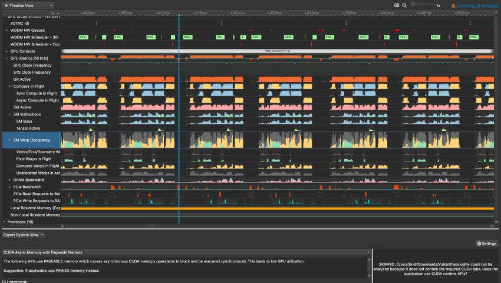
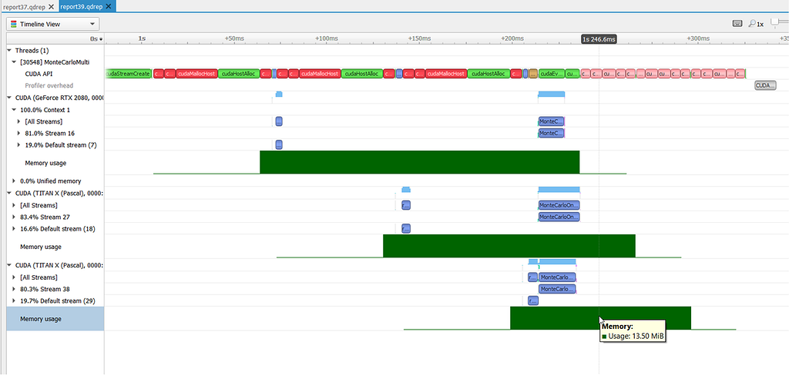
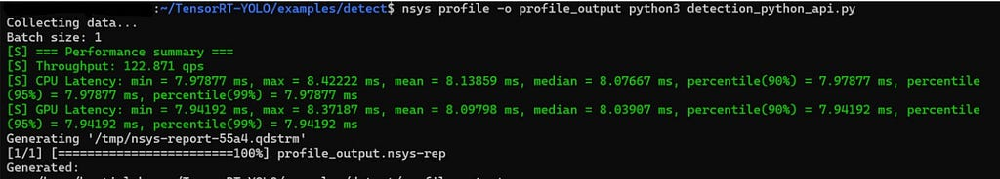
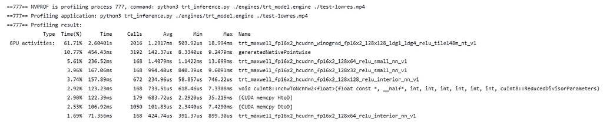
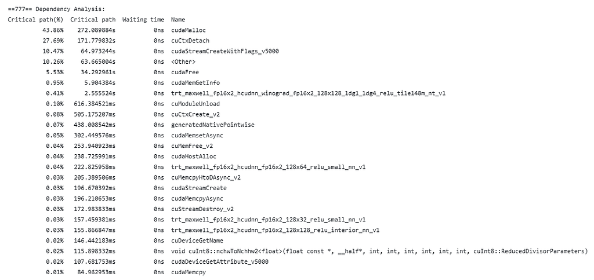

# 用 Nsight Systems 定位深度学习推理瓶颈

```{contents} 本页目录
---
depth: 2
local: true
---
```

模型推理变慢时，平均耗时只告诉我们“慢了”，却没有说明时间花在 CPU 预处理、Host 到 Device 的数据搬运、CUDA 同步、kernel 启动，还是某个 kernel 内部。性能分析的价值，就是把一次端到端推理拆回这些真实活动，再用时间线和统计数据决定下一步该改哪里。

本章整理自 Raksha Chandrashekar 的实践文章，并结合 NVIDIA 工具的当前状态补充了一套可复现的分析流程。示例覆盖 Jetson 一类边缘设备，也适用于数据中心 GPU。两类环境的硬件规模不同，判断链路相同：先定位时间花在哪里，再下钻到限制吞吐的机制。

<callout emoji="💡">
一次有效的 profiling 应回答三个问题：CPU 何时提交工作，数据何时跨越 CPU 与 GPU，GPU 在每个时间段实际执行了什么。先用系统级时间线回答前两个问题，再用 kernel 级指标回答第三个问题。
</callout>



## 先分清三类工具的观察范围

我更习惯把分析拆成两轮。第一轮看全局，确认瓶颈属于哪条链路；第二轮只盯住已经确认的热点。这样既能控制采集开销，也能避免在错误的 kernel 上花时间。

| 工具 | 最适合回答的问题 | 使用边界 |
|-|-|-|
| Nsight Systems | 端到端时间花在哪里；CPU、CUDA API、内存拷贝和 GPU kernel 是否重叠；哪一段出现空洞或同步等待 | 负责系统级 tracing 和 sampling，适合作为第一站，不负责解释单个 kernel 的每条指令为什么慢 |
| Nsight Compute | 一个 kernel 受计算、显存带宽、缓存、占用率、分支还是指令吞吐限制 | 指标采集开销更高，应在 Nsight Systems 已经找到热点后定点分析 |
| `nvprof` | 旧 CUDA 环境中的 kernel 汇总、API 汇总和简单 trace | Volta 是完整支持的最后一代架构；CUDA 13.0 已移除该工具，现代环境应迁移到 Nsight Systems 和 Nsight Compute |

这个分工很重要。系统时间线显示某个 kernel 很长，只能证明它占用时间多；要判断它受算力、访存还是并行度限制，还需要 Nsight Compute。反过来，如果 GPU 时间线存在大段空白，直接分析某个 kernel 的缓存命中率也不会解决 CPU 供给不足或同步阻塞。

## 采集前先把实验变得可比较

profiling 会改变程序运行时序，首次执行还可能混入模型加载、CUDA context 初始化、TensorRT engine 构建和 autotune。采集前应固定输入、batch size、精度、设备频率策略和软件版本，并先完成 warm-up。只比较同一测量口径下的结果，优化前后的差值才有意义。

| 检查项 | 为什么要固定 | 建议做法 |
|-|-|-|
| 输入与 batch | 序列长度、图片尺寸和 batch 会直接改变 kernel 形状与数量 | 保留一组固定样本，记录实际 shape 和 batch size |
| warm-up | 首次执行包含初始化、编译和缓存填充 | 先运行若干轮，再采集稳定区间 |
| 同步口径 | CUDA 异步执行会让 host 侧计时提前结束 | 端到端计时在边界处显式同步，profiling 时再检查同步位置是否合理 |
| 采集窗口 | 长时间全量 trace 会扩大文件并增加扰动 | 只采集少量稳定迭代，用 NVTX 标注预处理、推理和后处理 |
| 基线指标 | 单看一张时间线无法判断业务结果是否改善 | 同时记录吞吐、平均延迟、P90、P95、P99 和显存峰值 |

开始前先确认 GPU、驱动和工具可见：

```bash
nvidia-smi
nsys --version
ncu --version
```

安装方式随操作系统、CPU 架构和 CUDA 版本变化。应从 NVIDIA Nsight Systems 下载页选择匹配的 x86_64、Arm SBSA 或 Jetson 包，不要把旧版 Ubuntu 仓库命令照搬到新系统。

## 用 Nsight Systems 建立端到端时间线

### 从一条可复现命令开始

下面的命令同时采集 CUDA 活动、NVTX 标注和操作系统运行时事件。`file.py` 与输入文件替换为真实推理入口：

```bash
nsys profile -o profile_output --trace=cuda,nvtx,osrt python file.py --input input.mp4
```

| 参数 | 含义 |
|-|-|
| `--trace=cuda,nvtx,osrt` | 关联 CUDA API、GPU 活动、NVTX 区间和操作系统运行时行为 |
| `-o profile_output` | 生成 `profile_output.nsys-rep` |
| `nvtx` | 把业务阶段映射到时间线，例如 decode、preprocess、infer 和 postprocess |

采集完成后，可以打开 GUI，也可以先从命令行查看汇总：

```bash
nsys-ui profile_output.nsys-rep
nsys stats profile_output.nsys-rep
```

### 按依赖链读取时间线

时间线从上到下通常包含 CPU 线程、CUDA API、GPU context、stream、kernel 和 memory copy。阅读时不要只找最长的色块，应沿一轮推理的依赖关系依次检查：

1. CPU 在何时完成预处理并提交 CUDA 工作。CPU 线程长时间忙碌而 GPU 空闲，通常说明输入管线供给不足。
2. CUDA API 调用与 GPU 执行之间是否存在明显间隔。频繁的小 kernel、同步 API 或分配释放操作都可能形成 launch gap。
3. HtoD、DtoH 与 kernel 是否能够重叠。拷贝和计算全部串行时，要继续检查 pinned memory、异步拷贝、stream 和数据依赖。
4. 多个 stream 是否真正并发。界面上存在多个 stream，不等于硬件同时执行；依赖、资源占用和默认 stream 语义都可能把它们重新串行化。
5. 推理结束前有哪些同步点。`cudaDeviceSynchronize()`、同步 `cudaMemcpy`，以及把 GPU tensor 读回 CPU 的操作，都可能让 host 阻塞。



这张图里，CUDA API 调用集中出现在 CPU 线程轨道，GPU 工作则落在各设备的 stream 上。分析的关键是横向对齐：CPU 提交发生后，GPU 何时开始；不同 GPU 是否同时工作；绿色的显存占用区间是否覆盖了实际推理；设备之间有没有等待造成的空档。

### 把吞吐和延迟放回同一个口径

示例中的 TensorRT YOLO 推理使用 `batch size=1`，吞吐为 122.871 QPS，CPU 平均延迟约 8.13859 ms，GPU 平均延迟约 8.09798 ms。单请求串行执行时，吞吐与延迟满足近似关系：

$$QPS\approx\frac{1000}{latency_{ms}}$$

代入 CPU 平均延迟可得：

$$\frac{1000}{8.13859}\approx122.87\;QPS$$



这组数字说明测量口径自洽，也说明大部分端到端时间与 GPU 推理时间重合。它还不能单独证明 GPU 利用率已经充分。若要判断是否还有重叠空间，需要继续看时间线中的空洞、拷贝和 stream；若要判断 kernel 是否用满硬件，则要进入 Nsight Compute。

平均值还会掩盖偶发抖动。线上推理至少同时查看 P90、P95 和 P99。平均延迟下降但 P99 上升，可能意味着 batching、内存分配或调度策略增加了尾部等待。

## 旧环境中的 nvprof 应该怎样读

仍在旧 CUDA 和受支持 GPU 上运行的应用，可以用 `nvprof` 快速生成终端报告：

```bash
nvprof --unified-memory-profiling off --dependency-analysis --log-file profiling_log.txt python3 inference.py ./input.mp4
```

常见辅助选项包括 `--print-gpu-trace`、`--metrics flop_count_sp` 和 `--csv`。可用指标可以通过 `nvprof --query-metrics` 查询。指标越多，kernel 往往需要重放越多次，因此一次采集大量 metric 得到的运行时间不宜直接当作生产延迟。



图中的 `Time(%)` 是捕获到的 GPU 活动内部占比，不是整个进程 wall time 的占比。某个卷积 kernel 占 61.71%，说明它是 GPU 侧的主要热点；如果进程还有很长的 CPU 预处理或等待，这个百分比不会把那部分时间算进去。`Calls` 同样重要：单次很短但调用数极高的 kernel，可能暴露算子碎片化和 launch overhead。



依赖分析中，`cudaMalloc`、context 创建和 stream 创建占据较长 critical path，通常意味着采集窗口包含初始化阶段。若目标是稳态推理，应把初始化移出测量窗口；若目标是冷启动，这些成本就必须保留，并进一步检查内存复用、engine 缓存和进程生命周期。

<callout emoji="💡">
`nvprof` 已经退出现代 CUDA 工具链。NVIDIA 文档明确说明：Volta 是完整支持的最后一代架构，CUDA 13.0 已移除 Visual Profiler 和 `nvprof`。新项目直接使用 Nsight Systems 做系统级分析，使用 Nsight Compute 做 kernel 级分析。
</callout>

## 把时间线症状映射到优化动作

profiling 的输出本身不是结论。每个优化动作都应由一个可观测症状触发，并在相同输入和测量口径下复测。

| 可观测症状 | 优先验证的原因 | 对应动作 |
|-|-|-|
| GPU 前出现长 CPU 空档 | decode、预处理、DataLoader、Python 调度或锁等待 | 给阶段加 NVTX；并行预处理；预取输入；减少 Python 热路径 |
| HtoD 占比高且不与计算重叠 | pageable host memory、同步拷贝、每轮重复搬运 | 使用 pinned memory；复用 device buffer；异步拷贝；检查 stream 依赖 |
| 大量短 kernel 与 launch gap | 算子碎片化、batch 太小、host launch overhead | 做算子融合；评估 TensorRT、TorchScript 或 `torch.compile`；在适用场景使用 CUDA Graphs |
| 默认 stream 上工作完全串行 | 隐式依赖或单 stream 调度 | 确认无数据依赖后拆分 stream；让拷贝与计算重叠；避免无必要的全设备同步 |
| `cudaMalloc` 与 `cudaFree` 进入热路径 | 每轮动态分配、临时 tensor 生命周期过短 | 预分配并复用 buffer；使用框架内存池；稳定输入 shape |
| 一个 kernel 长期占据主要 GPU 时间 | 计算吞吐、显存带宽、缓存、占用率或分支效率 | 用 Nsight Compute 定点采集；再决定布局、tile、精度、Tensor Core 或算法优化 |
| 平均延迟稳定但 P99 偏高 | 动态 batching、内存回收、调度竞争、输入 shape 波动 | 按请求 shape 和 batch 分桶；关联 CPU 调度与 GPU 队列；单独分析慢样本 |

batch size 调优也要沿着数据判断。小 batch 可能让 GPU 吃不满，大 batch 会增加排队时间和显存压力。吞吐优先的离线任务可以扩大 batch；受 P99 约束的在线服务则要同时观察等待时间和服务时间，不能只追求 QPS。

FP16 和 INT8 可以减少计算量与数据体积，但收益取决于 kernel 是否进入对应的 Tensor Core 路径，以及量化、转换和精度约束带来的额外成本。时间线先确认热点位置，Nsight Compute 再确认指令与吞吐，最后通过精度验证决定是否上线。

## 一次完整的性能分析应该形成闭环

1. 固定输入、batch、精度和软件环境，完成 warm-up，记录吞吐与延迟分位数。
2. 用 NVTX 标出预处理、推理和后处理，只采集少量稳定迭代。
3. 在 Nsight Systems 中沿 CPU、CUDA API、拷贝、stream 和 kernel 的依赖链找到主导时间。
4. 如果热点落到单个 kernel，用 Nsight Compute 检查计算、带宽、缓存、占用率和指令路径。
5. 每次只改变一个主要因素，在相同口径下复测平均延迟、P99、QPS、显存和结果精度。

最容易浪费时间的做法，是看到 GPU 利用率不高便直接改 kernel，或看到某个 kernel 占比高便假设它内部效率低。前者可能忽略 CPU 供给和同步，后者可能只是因为该 kernel 承担了最多的必要工作。时间线负责定位，指标负责解释，复测负责证明优化成立。

profiling 因此是一轮持续收敛的实验：先用较低开销的数据缩小范围，再对热点增加观测精度。工具不会替我们选择优化方向，但它能把每次修改从猜测变成可验证的因果链。
